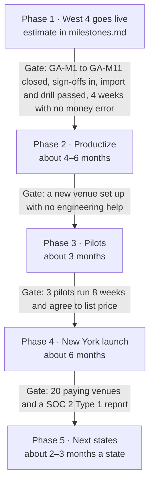

# Product blueprint

Sep 29, 2026 · @Abhishek Gaire

Build one system that runs any karaoke venue — private rooms, bar-style mics and rooms with a kitchen — launch it in New York with West 4 as the first customer, then expand state by state.

## What we're building

One system runs the whole karaoke night: booking and deposits, rooms billed by the minute, ordering from guests' phones, bar and kitchen screens, the song queue, staff PINs and tips, texts, the end-of-night report and the venue's own website. West 4 is the first venue and will be the live demo. Nothing of ours is live yet: the design canvas is a clickable prototype, and no production code exists.

Karaoke venues fall between kinds of software, and none covers the whole night:

- **Restaurant POS has no room clock.** A vendor that sells to pool halls says Square and Clover have "zero concept of table sessions," so timed charges get typed in by hand ([CuePoint](https://www.cuepoint.cloud/blog/best-pos-system-for-pool-halls)).
- **Karaoke platforms stop at the music.** [KaraFun Box](https://business.karafun.com/box/) costs $199 per room per month and schedules and locks rooms but bills nothing. KaraFun's own guide sends venues to Toast or Lightspeed for food and drink ([KaraFun guide](https://business.karafun.com/resources-start-karaoke-business/1223-best-apps-to-run-a-karaoke-box-business.html)).
- **Time billing exists, but not the karaoke night.** Pool-hall and bowling software already bills by the minute and per person ([CuePoint](https://www.cuepoint.cloud/), [BilliardPOS](https://billiardpos.net/en/), [Conqueror X](https://qubicaamf.com.au/conqueror-x-management-system/)), with no song queue, no bar acceptance of room orders and no New York bar rules. Chinese KTV suites run the whole night, but for China only, with no US card processing ([乾元坤和](https://www.qykh2009.com/sol_help_3.html)). The closest US rivals, [VenueTap](https://venuetappos.com) and [iTab](https://www.itabpos.com/karaoke-bars-restaurants-pos/), claim KTV room timers but document no billing mechanics, deposits or song control.
- **Booking is still manual.** Most New York venues take requests by web form, then confirm by phone or email ([Gagopa](https://www.gagopakaraoke.com/reservation), [Sing Sing](https://www.karaokesingsing.com/reservation)); one uses a Google Form ([Karaoke K](https://karaokek.com/)).

| What venues juggle today | What this system does instead |
| --- | --- |
| A bar POS plus a separate room timer | One live board: every room's clock, tab and status |
| Booking forms and call-backs | Online booking with deposits, self-service changes and cancellations |
| A paper waitlist at the door | A QR waitlist with "room ready" texts |
| Post-it notes for the bar mic ([Planet Rose](https://www.planetrosenyc.com/)) | A phone song queue with fair rotation and per-song charges |
| Waving down staff for drinks | Ordering from the room, an order queue the bar can't miss and a printed ticket |
| A time clock and a tip spreadsheet | Badge and PIN sign-ins, a compliant tip pool and a Z report |

At launch it serves New York venues with private rooms, bar-style karaoke, or rooms with a kitchen.

## Venue types

New York karaoke venues follow three operating models: private rooms, a shared bar mic, and rooms served by a kitchen. Many venues mix two or all three, so the product switches modules on per venue rather than selling three products.

| Venue type | NYC examples | How the night runs | Pricing models seen | What the software switches on |
| --- | --- | --- | --- | --- |
| Private rooms, downtown Manhattan | [Sing Sing St Marks](https://www.karaokesingsing.com/reservation), [Sing Sing Ave A](https://www.singsingavea.com/reserve), [Boho Orchard](https://www.karaokeboho.com/privateroom), [West 4](https://www.west4karaoke.com/) | Web-form booking, often confirmed by hand; 1–2 hour minimum; 10–15 minute grace period; extensions "not guaranteed"; open to 4 AM | $10/person/hr after 8 PM, $5–$6 before; weekend minimum party of 4–8; 18–21% gratuity; VIP flat $230–$250/hr | Room clock with per-person rate, 8 PM time band and minimum headcount; deposits; waitlist; soft end time |
| Private rooms, Koreatown noraebang | [Gagopa](https://www.gagopakaraoke.com/reservation), [POP](https://popkaraoke32.com/), [Space](https://spacekaraoke.com/), Chorus, Karaoke K, Maru; Northern Blvd in Queens | Upper-floor rooms along W 32nd St; TJ Media or Playbox players; bottle service; booking by web form, Google Form, Square or OpenTable | Base rate for the first 4–6 guests plus $8–$10 per extra guest (POP $55–$60 for 4, plus $8); bottle packages $390–$5,200 | Base-plus-extra-guest pricing; packages with liquor-law guards; Korean screens; song-system adapter |
| Private rooms, Flushing Chinese KTV | [9 Plus KTV](https://www.9plusktv.com/), [The Real KTV](https://www.theinfatuation.com/new-york/reviews/the-real-ktv), Wave KTV | 20+ themed rooms and suites; touchscreen song tablets; booking by phone, web page or WeChat; open 2 PM–4 AM | $40/hr with a 2-hour minimum; drinks deducted from the room fee | Flat rates by room size; minimum spend credited to the room fee (phase 2); Chinese screens; kitchen module |
| Bar-style karaoke | [Planet Rose](https://www.planetrosenyc.com/), Winnie's, the bars at Baby Grand and Sing Sing Ave A; [about 60 NYC bars](https://findkaraoke.net/states/ny) with karaoke nights | A KJ runs one shared mic; guests browse a QR songbook, hand over post-its and wait to be called | [$1–$2 per song plus a 1–2 drink minimum](https://secretnyc.co/sing-your-heart-out-top-karaoke-spots-in-nyc/); free karaoke nights; a free song with each drink at [Boho Orchard](https://www.karaokeboho.com/) | Bar tabs with a rising card hold; phone song queue with fair rotation; per-song charges; Up next TV; drink minimums |
| Rooms with a kitchen | [Sing Sing Astoria](https://p2bars.com/bars-near-me/singsing-karaoke-bar-chicken/), [Insa](https://insabrooklyn.com/karaoke), The Real KTV/Royal Queen, So Gong Dong Tofu | One kitchen feeds rooms, bar and takeout; group platters, wings and ramen; Sing Sing Astoria opens at 11 AM | [Chorus packages](https://choruskaraoke.com/packages/) of room time, drinks and one food pick, $190–$1,100; Insa rooms $80–$200/hr | Kitchen screens and stations; holds and coursing; package food fired at room start; allergy notice; 86 by option |
| Hybrids | West 4 (rooms plus bar mic), [Chorus](https://choruskaraoke.com/pricing/) (rooms, bar lounge, room service), [Baby Grand](https://www.babygrandnyc.com/private-rooms-flatiron), [Muses 35](https://www.cbsnews.com/newyork/news/lift-your-voice-at-these-3-new-karaoke-spots-in-new-york-city) | Rooms and a public bar share staff, bar and often a kitchen; guests move between zones | Room rates, per-song bar pricing and packages under one roof | All matching modules on one check; move a bar tab into a room; menus and prices per zone |

Venues range from [5 rooms at AUX Karaoke Box](https://bushwickdaily.com/music-and-nightlife/aux-karaoke-box-ocean-hill-brooklyn-opening-about/) to 14–20 in Manhattan and Flushing and [45 at 100 Fun](https://secretnyc.co/sing-your-heart-out-top-karaoke-spots-in-nyc/) in Sunset Park. In state liquor license data, [11 of 47](https://data.ny.gov/resource/9s3h-dpkz.json?$q=karaoke&$select=legalname,dba,premisescounty,city,description,type,class,originalissuedate) name-matched licenses are "Restaurant" licenses, including both Boho sites. The health department classes a Sing Sing site, Gagopa and Muses 35 as ["Bottled Beverages"](<https://data.cityofnewyork.us/resource/43nn-pn8j.json?$select=camis,dba,boro,zipcode,cuisine_description&$group=camis,dba,boro,zipcode,cuisine_description&$where=upper(dba)%20like%20'%25KARAOKE%25'>) with no real kitchen, so kitchen features must switch off per venue.

## Every module

The table splits the product into 28 pieces of work: 9 are "Prototyped (canvas)", 14 "In progress", 2 "Specified, no screen" and 3 "Not started". They aren't the switches a venue sees: a venue turns 19 modules on or off and 4 core modules are always on, which is why Setup and Admin count 19, with 13 on at West 4. Codes such as GA-M5 or GA-S1 point to the must-fix (GA-M1 to GA-M11), should-have (GA-S1 to GA-S12) and nice-to-have (GA-N1 to GA-N12) items of the earlier [Karaoke bar POS gap analysis](archive/research/karaoke-bar-pos-gap-analysis.md). [Phase 1 milestones](milestones.md) maps each GA-M item to its spec section and milestone.

**Status terms.** "Prototyped (canvas)": a clickable design prototype exists; no production code exists yet. "In progress": part of it is on the canvas, and the row names what isn't. "Specified, no screen": the [spec](spec/README.md) covers it, but nothing is drawn. "Not started": neither. Statuses follow the canvas as frozen at v39, the 27 screens in [design/canvas](../design/canvas/boards.json); parts marked for a later phase don't count. Where the canvas and the spec differ, the spec wins.

| Module | What it covers | Venue types | Status |
| --- | --- | --- | --- |
| Guest website and booking | Homepage, rooms, three-tap booking with deposit, song search, menu page and PDF, manage-booking and private-party pages, with a full-price summary and stored terms acceptance (GA-M5); not on the canvas yet: the booking's details, payment and confirmation steps | All | In progress |
| Website builder | Venues make their own site inside the software: three starting styles (Neon, Flyer, Lounge), accent and fonts, photos, sections on or off and in any order, text, Google details, languages, own domain; sections follow which modules are on | All | Prototyped (canvas) |
| Deposits and cancellations | Deposit by first hour, $ per person, flat amount or % of booking; refund cutoff; late-cancel and no-show outcomes; big-party deposit; self-serve cancel with refund | Rooms | Prototyped (canvas) |
| Tonight board, staff phone and waitlist | Room tiles with states and top-3 alerts; check-in, move room, no-show and refunds by phone; QR walk-in waitlist with wait estimate and 10-minute room-ready countdown | Rooms | Prototyped (canvas) |
| Room clock and time billing | Per-person rate, per-minute overage and soft end time; base plus extra guest, flat by room size, 8 PM bands, weekend rules, minimum headcount, minimum spend (off at West 4) and pause (GA-S1); rate bands in every pricing mode, each with a billing increment and a rounding rule, held in the data model from phase 1; not on the canvas yet: pause and resume, and minimum spend; holiday rules and minimum spend credited against the room fee are phase 2 | Rooms | In progress |
| Room operations | Cleaning state, damage fee with photo, lost and found, cleaning time reserved between bookings and a per-room equipment fault log tied to comps (GA-S5); not on the canvas yet: the fault log with Out of service, and lost and found; a signed cleaning checklist is phase 2 | Rooms | In progress |
| Guest phone ordering | Room QR and code, full menu with options, live order status, call staff, host lock, a running bill, a pay-cash-to-staff path, "Same again" and "Pay my share" (GA-S3); not on the canvas yet: the join step, the room-tablet view, "Your bill" with pay cash to staff, "Same again" and "Pay my share"; the allergy notice and allergen fields are phase 2 | Rooms | In progress |
| Bar screen and tickets | Room orders stay on screen until accepted, with a printed ticket, a "Ready for a runner" status, out-tonight items, a 1-minute mute and runs to carry on staff phones. Ages on screen: amber at 2 min, pink at 4 when the manager on duty is told; bar phones at 30 s; a text or call at 6; chime as backup. | All | Prototyped (canvas) |
| Kitchen display and food | Station routing, holds and coursing, package food fired at room start, allergy notice and input, 86 by item or option, dining option (room, bar, to-go), delivered-to-room step, all-day counts, recall, a local-network fallback and a prep-time report | Kitchen | Not started |
| Bar POS, tabs and quick sale | The bar POS (badge sign-in, a fixed grid, repeat round and undo, card-first tabs with one tab per card, tips on the reader, one-tap cash, reopen, and Charge the remaining tabs at close), and a card hold that rises with the tab through [Stripe incremental authorization](https://docs.stripe.com/terminal/features/incremental-authorizations), quick sale, move to room, and a 4:30 AM cut-off that captures any tab still open (GA-M11) | Bar | Prototyped (canvas) |
| Bar mode | Phone song queue with fair rotation and a per-round limit, "2 singers before you" and "You're up next" alerts by push and text, a KJ songbook upload (CSV), drink credits, a per-song charge when the song starts, the KJ's song queue screen, an Up next TV board and "send the singer a drink" with a cut-off check (GA-M11); the canvas has only its switch in Admin → Features | Bar | Specified, no screen |
| Song system control | Lock the player outside sessions, on-TV countdown and 10-minute warning, song-play log; depends on each vendor, through adapters in phase 2, KaraFun first (GA-S4); a per-room volume cap with log is phase 2; phase 1 trials a switched outlet on one room's mic receiver, only with West 4's approval and after a Playbox warranty check | Rooms | Specified, no screen |
| Packages and specials | Room time, bottles and food picks; happy-hour prices; [§117-a](https://www.nysenate.gov/legislation/laws/ABC/117-A) guards against unlimited drinks, free drinks and prices below half (GA-S2); not on the canvas yet: the package builder; headcount tiers and packages prepaid in the booking are phase 2 | All | In progress |
| Payments and surcharge engine | Stripe deposits and card, cash or split close-out, guests paying their own share from their phones, Stripe Connect, card readers at the bar and the front desk, and a card fee each venue picks: off, a capped credit-only surcharge or a cash discount (GA-M1); not on the canvas yet: guests paying their own share, the failure states ("Declined", "Checking with Stripe · don't retry", "Refund pending"), the dispute inbox (GA-S10) and payout matching | All | In progress |
| Checks, tax categories and records | Z report; comps and voids with a reason, and a manager's approval over the limit; printed, texted and emailed receipts; a searchable action log; a tax category per line, uneditable sequential check numbers and no deletes (GA-M4); not on the canvas yet: the printed and web receipts, and check numbers | All | In progress |
| Team, roles, time clock and tip pool | Owner, Manager, Bartender, Front desk and Staff roles; a badge tap, or your name then your PIN, with 6-digit PINs for managers; a time clock with the duty picked at clock-in; training mode; tip pool by hours worked; eligibility per person, 6-year records and a split payroll export (GA-M2); not on the canvas yet: the Front desk role, badge pairing, the duty at clock-in and training mode | All | In progress |
| Messages and marketing consent | Two-way texts, 12 service texts (including "You're up next" for bar mode) and 2 marketing texts, off until they have their own opt-in; separate marketing consent, 8 AM–9 PM marketing hours, opt-out handling and 10DLC registration (GA-M3); not on the canvas yet: the "You're up next" text, the marketing opt-in and one-tap opt-out | All | In progress |
| Safety, ID and incident records | Discreet "I need help" alert to managers' phones, incident log kept 3 years, banned list, ID checks at check-in with scans keeping four fields, live headcount with a door counter against the occupancy limit (GA-S6–GA-S8); not on the canvas yet: the managers' alert, the incident log, the ID count at check-in and the door counter; room welfare timers are phase 2 | All | In progress |
| Alcohol controls | Every room order needs bar acceptance; a county closing-hour stop on all channels, where unaccepted alcohol orders cancel automatically at the close; a 30-minute clear-out check; cut-off for a tab, a room or a guest; and a refusal log (GA-M6, GA-M7); not on the canvas yet: the automatic cancel (the canvas shows a Decline button), the clear-out check and cutting off a room or a guest | All | In progress |
| Reports and accounting export | Weekly and 8-week trends, sales-tax quarters and Export for QuickBooks, a balanced daily journal file the venue imports (GA-S12); not on the canvas yet: the sales-tax quarter report; the $300,000 sales-tax alert, revenue per room-hour, ticket times and labor share are phase 2 | All | In progress |
| Devices, printers and offline | Printer, drawer, reader, badge reader, tablet and backup-router settings; the desktop app with USB printing; lockouts per person and per device; a queue mode with offline codes, replay and a review list for when the line and LTE are both down (GA-M8); not on the canvas yet: the badge readers, the backup-internet and offline banners, queue mode, replay and the review list | All | In progress |
| Admin settings | Hours, prices, deposits, alerts, menu, rooms, website, roles, cash drawers, bar mode and connections for one venue, within the New York rule pack; not on the canvas yet: Bar POS layouts and limits, the tab settings, badges, minimum spend, guests paying their share, training mode, staff languages and the license register (GA-M10); multi-venue settings are phase 2 | All | In progress |
| Module switches and plans | Our control panel sets what each venue's plan allows (plan modules, add-ons, beta flags); the venue's Admin → Features turns modules on or off within that; core modules always on; dependencies handled; turned-off modules disappear from menus and the website | All | Prototyped (canvas) |
| Venue setup wizard | Ten steps from sign-up to go-live: the address sets the rule pack, "what you run" picks the plan and modules, then rooms and pricing, menu upload, songs, team, Stripe, devices, website style and a test night | All | Prototyped (canvas) |
| Multi-location and owner accounts | One owner login across venues, shared menus and pricing, combined reports, one Stripe account per legal entity | All | Not started |
| Vendor control panel | Venue list and health, plans, module access per venue, setup progress, support access with reason and audit log, billing and rule packs; a minimal internal version ships in phase 1 (support grants, emergency actions, rule-pack publishing and the module allow-list), and the full panel in phase 2 | All | Prototyped (canvas) |
| Guest CRM, loyalty and gift cards | Guest profiles with visits and spend, VIP tags, gift cards, punch cards and prepaid hours, kept apart from ID-scan data (GA-N2, GA-N3); phase 1 reserves a prepaid-value ledger, phase 2 adds gift cards and guest profiles, and phase 3 stored value, loyalty and campaigns | All | Not started |
| Event sales | Inquiry form, cost estimator and big-party booking; proposals, e-signed contracts, deposit schedules and pre-picked menus (GA-N1) come in phases 2 and 3, and events and ticketing in phase 3; a VIP room's minimum spend uses the phase 1 minimum spend setting | Rooms | Prototyped (canvas) |

## Settings each venue controls

Each venue controls 27 groups of settings, and West 4's current values show which defaults must change. Three need changes before launch: the 3.5% card fee, the hand-typed 20% gratuity and the single 8.875% tax rate. We recommend letting a venue tighten any legal default from the rule pack but never loosen it.

| Setting | Options | West 4 today |
| --- | --- | --- |
| Modules | Which modules are on, within what the plan allows; core modules always on; asking for add-ons | Rooms plan; 13 of 19 modules on |
| Pricing model | Per person per hour; base rate for the first N guests plus an extra-guest rate; flat rate by room size; flat VIP rate | $10/person/hr; VIP room $250/hr for 20+ |
| Time bands | Rates that change at set times, mid-session included (such as 8 PM), in any pricing mode, each with a billing increment and a rounding rule; separate weekday and weekend rules; holiday rules in phase 2 | One rate at all hours |
| Minimums | Minimum session, then per-minute billing; minimum billable headcount by day | 1-hour minimum, then per-minute; the site says "Minimum 3 People" but billing ignores it |
| Minimum spend | Off, or a minimum per room size and day, shown live on the tile, the room tab and the room page ("$84 to your minimum"), with any shortfall added at close; credited against the room fee in phase 2 | Off |
| Deposit rule | First hour, $ per person, flat amount or % of booking; refund cutoff in hours; late-cancel and no-show outcomes; big-party deposit | First-hour deposit, refundable up to 24 hours before |
| Gratuity rule and label | Off, room tabs, parties of a set size or every tab, at the venue's own %; fixed label "Gratuity, paid in full to service staff", never shared with owners or managers; a card-reader tip screen with three set choices when no gratuity is on the tab; same text on site, confirmation, screen and receipt | Automatic 20% on rooms; amount typed by hand into website text |
| Card fee | Off (the default); credit card surcharge, credit only, capped at the lowest of actual cost, [Visa's 3%](https://usa.visa.com/dam/VCOM/global/support-legal/documents/merchant-surcharging-considerations-and-requirements.pdf) and Stripe's cap, starting 30 days after notice to Visa, Mastercard and Stripe; cash discount, where menu prices are card prices (lawyer to confirm debit treatment) | Flat 3.5% on every card, above Visa's and Stripe's 3% caps; starts off in the new system |
| Guests pay their share | On or off: from the room page, each guest pays their own items or an even share, with their share of tax and gratuity, by Apple Pay, Google Pay or card; the booker's card still guarantees the rest | On |
| Cash drawers | One house drawer, which everyone rings cash into and the manager on duty answers for, handed over with a blind count; or a drawer per person, where each bartender (or servers too) counts a bank in and their cash out, a tray can be pulled and counted at close, and over or short is theirs; starting bank, note limit, second counter and paid-out approval; a switch starts with the next business date | Two house drawers, one on the bar printer and one at the front desk; cash goes into the drawer where it's taken, and the manager on duty answers for both |
| Tax jurisdiction | Rate and reporting code set from the address ([Pub 718](https://www.tax.ny.gov/pdf/publications/sales/pub718.pdf)); a tax category per line for room time, food and drink, gratuity, surcharge and fees | 8.875% on everything |
| Closing hour and last call | [County close](https://sla.ny.gov/county-closing-hours) from the rule pack; earlier house last call; clear-out check 30 minutes after close | Open to 4 AM, with no hard alcohol stop |
| Rooms and capacities | Name, size tier, capacity from the fire safety plan, cleaning minutes, VIP flag, bookable online or walk-in only | 14 private rooms; VIP room for 20+ |
| Occupancy limit | The venue's posted occupancy; the board counts everyone inside from check-ins, walk-ins and the door counter, and warns at 90% | Not entered yet, so the board shows "Limit not set · Admin → Safety" |
| Song system | Playbox, KaraFun, Singa, OpenKJ, TJ Media or none; control level full, queue only or manual | Playbox, with no control link |
| Bar mode | On or off; a price per song; drink credits, a song earned with each drink; songs per singer per round; singer alerts ("2 singers before you", "You're up next"); a KJ songbook upload (a CSV of title, artist and code) | On, with "Buy a drink, get a song"; song price not set, so each song needs a drink credit; 1 song per singer per round; alerts on; the Playbox songbook comes from Playbox or West 4 |
| Menu and stations | Items with options, tax category and alcohol flag, with allergens in phase 2; bar, kitchen and expo stations; kitchen on or off | 127-line menu with options; room orders go to the bar screen and printer |
| Bar POS | A layout per station: grid sections with fixed button slots and short button names, starting the next business date; reason-only limits for comps and voids, each and per shift; badge or name and PIN sign-in; idle and wipe locks; the tip path for bar tabs, on the reader or a slip; how room orders age and escalate | Favorites plus 9 sections; $25 each and $75 a shift; badges to buy; idle lock at 3 minutes, wipe lock at 10 seconds; tips on the reader. Ages on screen: amber at 2 min, pink at 4 when the manager on duty is told; bar phones at 30 s; a text or call at 6; chime as backup. |
| Bar tabs | The opening hold; the amount that flags a large tab; the cut-off time that charges any tab still open | $50 opening hold; flagged at $600; tabs still open are charged at 4:30 AM, 30 minutes after close |
| Packages | Room time, bottles, food picks and an extra-guest rate, with headcount tiers in phase 2; liquor-law checks always on | No package builder |
| Roles and permissions | Owner, Manager, Bartender, Front desk, Staff or custom roles; which actions need a manager's approval, given on the approver's own phone and never by the person asking, and a reason-only limit for small comps and voids; refunds always need a second person; two-step login for owner and admin | Owner, Manager, Bartender and Front desk, and the front desk can use the bar POS when covering the bar; comps and voids up to $25 each and $75 a shift need only a reason; above that, a manager approves on their own phone, and the owner approves the manager's own requests |
| Training mode | Per person, or per device for a new hire; screens show "TRAINING · not real money", and check numbers start with T- | Off |
| Tip pool eligibility and shares | Eligible or not per person, judged by [duties, not titles](https://www.law.cornell.edu/regulations/new-york/12-NYCRR-146-2.14); share per occupation; hours from the time clock | Hours from PIN sign-ins, with no per-person eligibility |
| Texts and consent | Each automatic text on or off; marketing only with a separate opt-in; marketing sent [8 AM–9 PM](https://www.nysenate.gov/legislation/laws/GBS/399-Z) only | 12 service texts, including "You're up next" for bar mode, and 2 marketing texts, review ask and birthday, which stay off until they have their own opt-in |
| Languages | Staff screens in English or Spanish, picked by each person in Admin → Team or at sign-in, with Korean and Chinese in phase 2; guest screens in English, Korean, Chinese (Simplified) and Spanish | English only; staff screens launch in English and Spanish |
| Website | Starting style (Neon, Flyer, Lounge), accent color, fonts, photos, sections on or off and in any order, text, Google details, free address or own domain | Neon style, 9 sections, west4karaoke.com |
| Devices | Bar computer, staff phones, room tablets, printers, cash drawers, card readers and badge readers; offline payment cap | A bar computer and a front-desk computer, staff phones, 14 room tablets, an Up next TV, a receipt printer and cash drawer at each desk, an S710 reader at the bar and one at the front desk, a USB badge reader at each, and a backup internet router; badge or name and PIN sign-in |

## New York rule pack

The New York rule pack keys each venue's legal rules to its location through three separate attributes: county, tax jurisdiction and wage region. The three don't line up: [Putnam County](https://sla.ny.gov/location/putnam-county) closes at 3 AM, taxes at 8.375% and pays the $16.00 rest-of-state minimum wage. The software sets all three from the venue's address at setup, and the vendor keeps the tables current.

### What changes by location

| Rule | How it varies | What the software does |
| --- | --- | --- |
| Alcohol closing hour | [4 AM in 24 counties](https://sla.ny.gov/county-closing-hours), including all of NYC, Nassau, Suffolk, Westchester, Erie and Albany; 3 AM in 5; 2 AM in 22, including Monroe and Onondaga; 1 AM base in 11 | Stops alcohol at the county close on every channel; the venue can set an earlier last call |
| Weekend and holiday closes | 8 counties below 4 AM vary by night, such as [Broome](https://sla.ny.gov/location/broome-county) (1 AM, but 3 AM Friday and Saturday); [Warren](https://sla.ny.gov/location/warren-county) closes at 2 AM on Sunday nights; holiday rules vary | In phase 2, with the rule packs for other counties: stores a close per night, holiday overrides and dated overrides such as the expired [2026 World Cup window](https://www.governor.ny.gov/news/governor-hochul-signs-legislation-extending-hours-bars-and-restaurants-during-2026-fifa-world) (lawyer to confirm SLA wording) |
| Sales tax rate | State 4% plus local: [7% to 8.875%](https://www.tax.ny.gov/pdf/publications/sales/pub718.pdf); Yonkers charges 8.875%, the rest of Westchester 8.375%; 18 cities report separately | Sets rate and reporting code from the address, not the county name; loads dated rates each quarter |
| Wage region | 2026: [$17.00](https://dol.ny.gov/minimum-wage-tipped-workers) in NYC, Long Island and Westchester ($11.35 cash wage plus $5.65 tip credit); $16.00 elsewhere ($10.70 plus $5.30); [indexed from 2027](https://www.ny.gov/new-york-states-minimum-wage/new-york-states-minimum-wage) | Sets the region by work site; checks tip credit, call-in and spread-of-hours pay at that rate; loads 2027 rates when published |
| NYC-only rules | Letter grades, [§10-177 cameras](https://legistar.council.nyc.gov/View.ashx?GUID=9DEAF056-66FB-4678-8DF3-C9A05000DE81&ID=5710167&M=F) (lawyer to confirm scope), [biometric signage](https://intro.nyc/local-laws/2021-3), [ESSTA leave](https://www.nyc.gov/site/dca/about/paid-sick-leave-law.page) with 32 unpaid hours, PACO and FDNY permits, proposed all-in pricing, no [Sunday 8 AM permits](https://www.nysenate.gov/legislation/laws/ABC/99-H) | Turns on NYC checklists, leave banks and price-display options for NYC addresses only |
| Local licenses | [Yonkers cabaret](https://ecode360.com/15111563) ($250 per floor a year; lawyer to confirm it covers karaoke), [White Plains cabaret](https://whiteplainspublicsafety.com/cabaret-licensing/) ($2,500), [Buffalo dance](https://ecode360.com/11767287) (none 3–8 AM), [Hempstead assembly](https://ecode360.com/15510872), [Rochester entertainment center](https://ecode360.com/8674181) | Keeps a license register with number, expiry, fee and conditions; flags events a license doesn't cover |
| Local noise | [NYC](https://nycadmincode.readthedocs.io/t24/c02/sch05/): 42 dB(A) inside a neighbor's home; [Buffalo](https://ecode360.com/11767329): audible past 100 feet; [Rochester](https://ecode360.com/8676945): audible past the property line after 10 PM; Hempstead: same line rule | Stores the local noise profile; logs complaints, and volume caps in phase 2 |
| Local leave | [Westchester](https://natlawreview.com/article/new-york-state-s-paid-sick-leave-law-preempts-westchester-county-s-earned-sick-leave) requires 40 hours of paid safe leave a year, apart from state sick leave | Adds a separate safe-leave bank for Westchester work sites |

### Same everywhere in New York

| Rule | What the software enforces |
| --- | --- |
| Card surcharge, [GBL §518](https://www.nysenate.gov/legislation/laws/GBS/518) | Credit cards only; lowest of actual cost, network cap and Stripe cap; card price posted before sale; separate receipt line; none on debit or prepaid |
| Cash acceptance, [GBL §396-ii](https://law.justia.com/codes/new-york/gbs/article-26/396-ii/) since Mar 21, 2026 | Cash offered for every on-premises payment, including room orders; no higher price for cash; bills over $20 may be refused (lawyer to confirm for NYC) |
| Gratuity and tip pool, [Hospitality Wage Order](https://www.law.cornell.edu/regulations/new-york/12-NYCRR-146-2.18) | "Gratuity" label; 100% to eligible service staff; eligibility by duties; hours from the time clock; records kept 6 years |
| Drink promotions, [ABCL §117-a](https://www.nysenate.gov/legislation/laws/ABC/117-A) and [SLA rules](https://sla.ny.gov/what-you-need-know-if-youre-licensed-retailer) | Blocks unlimited drinks for a fixed price, free drinks and prices below half the regular price; private-function exception only with lawyer approval |
| Drinking-up time, [ABCL §106](https://www.nysenate.gov/legislation/laws/ABC/106) | Clear-out check 30 minutes after the local close (lawyer to confirm it runs from the county close) |
| ID scans, [ABCL §65-b](https://www.nysenate.gov/legislation/laws/ABC/65-B) | Keeps only name, date of birth, ID number and expiry, plus the scan result; no marketing use or third-party sharing |
| Texting, [GBL §399-z](https://www.nysenate.gov/legislation/laws/GBS/399-Z) and [TCPA rules](https://www.ecfr.gov/current/title-47/chapter-I/subchapter-B/part-64/subpart-L/section-64.1200) | Marketing texts need written consent and go out 8 AM–9 PM only; an opt-out stops every message type |
| Allergy notice, [PHL §1356](https://www.nysenate.gov/legislation/laws/PBH/1356) | Notice on every menu, including room-screen and online menus, plus an allergy field on online orders (lawyer to confirm for bars with kitchens) |
| Data security, [SHIELD Act](https://www.nysenate.gov/legislation/laws/GBS/899-BB) | Named security lead, deletion schedule and [breach notices within 30 days](https://www.nysenate.gov/legislation/laws/GBS/899-AA) |
| Sales tax records, [TB-ST-806](https://www.tax.ny.gov/pubs_and_bulls/tg_bulletins/st/sales_by_restaurants.htm) | Sequential check numbers that can't be edited; dated Z reports; no deletes; kept at least 3 years |
| Time clocks, [Labor Law §201-a](https://law.justia.com/codes/new-york/lab/article-7/201-a/) | No fingerprints: staff clock in with a badge or name and PIN |
| Music licensing (federal), [17 U.S.C. §101](https://www.law.cornell.edu/uscode/text/17/101) | License register for ASCAP, BMI, SESAC and GMR; song-play logs where the song system allows |
| To-go alcohol, [ABCL §106(2-a)](https://www.nysenate.gov/legislation/laws/ABC/106) | Only with food, sealed and during licensed hours; switches off on April 9, 2030 (lawyer to confirm which hours apply) |

We recommend adding each new state as its own rule pack on these three attributes, so expansion adds tables and legal review, not code.

## Integrations

The product needs 11 kinds of outside connections, and song systems are the hardest because [Playbox](https://www.playboxkaraoke.com/), West 4's system, publishes no API.

| Category | Options | How we connect | Watch out |
| --- | --- | --- | --- |
| Song system: Playbox | Players and remote apps from KMS Tech; the [Android app](https://play.google.com/store/apps/details?id=com.ssmediaplayerremoteapp&hl=en_US) lists Sing Sing Media's support email and Bayside address | Negotiated agreement for the controls its [Playbox Remote](https://apps.apple.com/us/app/playbox-remote/id6755547370) app already uses over the room Wi-Fi (queue, skip, volume, key); until then, our own countdown and staff alerts | No public API; [Sing Sing Media](http://www.singsingmedia.com/singsing-karaoke/) sells its own bar and room systems with a POS and "Line Manager" |
| Song system: KaraFun | [KaraFun Box](https://business.karafun.com/box/) at $199/room/month; [KaraFun Pro](https://www.karafun.com/pro/) at $49.99/month | Token-based [venue API](https://business.karafun.com/resources-start-karaoke-business/1501-discover-the-new-api-feature-in-your-dashboard.html) to schedule sessions, control devices and read session data; [partners](https://business.karafun.com/api-integrations) already on it include Escape4, Playpro, Funbutler and SevenRooms | API docs only in the operator dashboard; song-start events not documented; Pro has no API |
| Song system: Singa | [Singa Box and Pro](https://help.singabusiness.com/how-to-use-karaoke-box) on iPad | Timed sessions and codes set by staff in Singa's admin page; no public API, but Singa [links to booking partners it picks](https://singa.com/blog/karaoke-room-reservation-software/), such as Roller and Funbutler, so a link needs a partner deal | Fixed [3-request cap](https://help.singabusiness.com/controlling-the-queue-and-song-requests) per guest; song history has no singer names; Singa sells its own [booking add-on](https://singa.com/blog/singa-booking/) that starts rooms on time |
| KJ software | [OpenKJ](https://github.com/OpenKJ/StandaloneRequestServer), [Karaoki](https://pcdj.com/karaoquest-free-karaoke-remote-request-app/), [kJams](https://karaoke.kjams.com/) | OpenKJ: serve its open request-server endpoints; others: the KJ copies songs from our queue | OpenKJ is a small project; Karaoki requests work only on the local network; kJams scripting is 32-bit only |
| Korean, Japanese and Chinese systems | [TJ Media](https://en.namu.wiki/w/TJ%EB%AF%B8%EB%94%94%EC%96%B4), Kumyoung, JOYSOUND, DAM, Thunderstone | None; the room clock and billing run outside the player | No English integration docs; US supply runs through resellers |
| Card readers | Stripe [S710 and S700 at $299](https://stripe.com/terminal), with cellular on the S710 for $10 a reader a month, and [WisePOS E at $249](https://stripe.com/terminal/wisepose); Tap to Pay. Not the M2: it pairs over Bluetooth through a mobile SDK, and our server-driven design has none | [Server-driven](https://docs.stripe.com/terminal/designing-integration) from our API (decided), so no SDK runs on staff screens; a native mobile SDK only if phase 2 adds offline | [Offline needs a native app](https://docs.stripe.com/terminal/features/operate-offline/overview.md?reader-type=internet); [$10,000 offline cap](https://docs.stripe.com/terminal/features/operate-offline/collect-card-payments.md?terminal-card-present-integration=terminal&reader-type=internet&terminal-sdk-platform=android); no incremental authorization offline |
| Payments platform | [Stripe Connect](https://docs.stripe.com/connect/risk-management) with direct charges; [Adyen](https://www.adyen.com/pricing) and [Finix](https://www.finix.com/pricing) as alternatives | One connected account per legal entity; one card-reader Location per venue | The [surcharge API](https://docs.stripe.com/payments/cards/surcharge) is in preview, and a surcharge can't grow with a rising card hold |
| Texting | [Twilio](https://www.twilio.com/en-us/sms/pricing/us) at $0.0083 per segment and $1.15 per number a month; [Telnyx](https://telnyx.com/pricing/messaging) at $0.004 per part, both plus carrier fees; Bandwidth | [10DLC](https://www.twilio.com/docs/messaging/compliance/a2p-10dlc) brand and campaigns per venue; replies arrive by webhook | Unregistered traffic pays extra carrier fees; [registry fees](https://www.tychron.com/the-campaign-registry/) run about $4.50 per brand, $15 vetting and $1.50–$10 a month per campaign |
| Payroll and scheduling | [7shifts](https://developers.7shifts.com/), [Gusto](https://docs.gusto.com/app-integrations/docs/updating-payrolls), [ADP](https://apps.adp.com/en-US/apps/410612/adp-api-central-for-adp-workforce-now/overview), [Toast Payroll](https://support.toasttab.com/en/article/Toast-Payroll-Custom-Payroll-Imports), [Homebase](https://app.joinhomebase.com/api-docs) | 7shifts customer token for hours, tips and tip pools; Gusto payroll API after approval; Toast CSV import; ADP paid API; Homebase only through a partner program (not planned) | Homebase API docs could not be read; the automatic gratuity must export as wages, not tips |
| Accounting | [QuickBooks Online](https://static.developer.intuit.com/resources/Intuit_App_Partner_Program_Guide.pdf), [Xero](https://developer.xero.com/pricing) | Export for QuickBooks: one balanced sales journal per venue each night, as a file the venue imports; a live QuickBooks or Xero connection only through their partner programs (not planned) | Xero's tiers from Mar 2, 2026: free to 5 connections, A$35 a month to 50, certification from the A$245 tier |
| Reservation channels | [Reserve with Google](https://developers.google.com/actions-center/verticals/reservations/e2e/overview), [OpenTable](https://www.opentable.com/restaurant-solutions/api-partners/faqs/), [Resy](https://resy.com/join/integrations/), [SevenRooms](https://sevenrooms.com/platform/integrations-apis/), Yelp | Partner programs only, and Yelp's is not planned; rooms already list as table bookings at [Maru](https://www.opentable.com/r/maru-karaoke-lounge) and [Insa](https://resy.com/cities/new-york-ny/venues/insa-karaoke-room) | No self-serve APIs; Google requires a multi-merchant partner; room length and per-person prices don't map; SevenRooms has been owned by DoorDash since June 13, 2025 ([Wikipedia](https://en.wikipedia.org/wiki/SevenRooms)) |
| ID scanners | [IDScan.net](https://idscan.net/sdks-and-apis/), [Intellicheck](https://idn-direct-api.readme.io/), [Patronscan](https://www.patronscan.com/developer), TokenWorks | Parse the barcode through an SDK and keep only the four [§65-b](https://www.nysenate.gov/legislation/laws/ABC/65-B) fields | Cloud scanners store data on their side by design; Patronscan's [shared ban list](https://idscan.net/veriscan-vs-patronscan/) may count as sharing (lawyer to confirm) |
| Printers and cash drawers | [Star CloudPRNT](https://star-m.jp/products/s_print/CloudPRNTSDK/Documentation/en/index.html), [Epson Server Direct Print](https://download4.epson.biz/sec_pubs/pos/reference_en/technology/server_direct_print.html), [Epson ePOS](https://download4.epson.biz/sec_pubs/pos/reference_en/epos_js/index.html), Star WebPRNT | Printers poll our server for jobs; the cash drawer opens through the printer | Browser printing over the local network runs into security-certificate problems |
| Kitchen screens | Our own web KDS on tablets; [Fresh KDS](https://fresh-technology.github.io/fresh.kds.docs.mobile-local-network-integration/docs/api/introduction/) | Build our own; Fresh through its cloud API with "order created" and "order bumped" webhooks | Toast, Square and Lightspeed screens work only with their own POS |
| Chinese and Korean channels | WeChat for Flushing KTVs such as [9 Plus KTV](https://www.9plusktv.com/); [Korea Portal](https://ny.koreaportal.com/yp/yp_list.php?mcode=lei&scode=lei_04) and [Korea Daily](https://yp.koreadaily.com/list/391?bra_code=NY) directories | WeChat link and QR on the booking page; staff enter those bookings | WeChat Pay works on US Stripe accounts, including as a QR code on the readers, but has no manual capture, so it can't hold a bar tab, and Connect direct charges are in private preview ([Stripe](https://docs.stripe.com/payments/wechat-pay); [Stripe Terminal](https://docs.stripe.com/terminal/payments/additional-payment-methods.md?terminal-sdk-platform=server-driven)); WeChat Pay at close-out is phase 3 |

We recommend a song-system-agnostic design. Room clocks, billing and ordering run in our product, and a "song system adapter" per vendor adds control only where that vendor allows it. We also recommend building our own bar queue, with song charges posted when staff mark a song started, so Playbox never blocks bar mode. Proposed adapter order: KaraFun first, since its API is documented, then OpenKJ's open request server, Playbox once it agrees and Singa through a partner deal; TJ Media and other Korean and Chinese systems stay manual.

## Platform

The platform runs each venue as a separate account on one codebase, with card payments through [Stripe Connect](https://docs.stripe.com/connect/risk-management).

**Accounts and data.** Each venue's data is walled off from every other venue, which AWS calls [fundamental to SaaS](https://docs.aws.amazon.com/whitepapers/latest/saas-tenant-isolation-strategies/saas-tenant-isolation-strategies.html). An owner account sits above its venues, with one Stripe account per legal entity and one card-reader Location per venue. Reader tokens are [scoped to that Location](https://docs.stripe.com/terminal/features/connect.md?connect-charge-type=direct), so readers can't cross venues.

**Setup wizard.** Ten steps, as on the canvas (phase 2):

1. Your venue: name, address and license; the address picks the rule pack.
2. What you run: private rooms, a bar with a karaoke mic or both, which picks the plan and modules.
3. Rooms and pricing: rooms, capacities, how you charge, minimums and the deposit.
4. Menu: import it once for the site, the PDF and room ordering.
5. Songs: the song system and what we can control.
6. Team: invites and roles; each person pairs a badge and sets their own PIN.
7. Payments: onboarding through [Stripe-hosted or embedded forms](https://docs.stripe.com/connect/onboarding), cash, the card fee and the gratuity.
8. Devices: card readers [drop-shipped and pre-registered](https://docs.stripe.com/terminal/fleet/order-and-return-readers), printers, tablets, badge readers and backup internet.
9. Website: pick a starting style (Neon, Flyer or Lounge), add photos and words, then refine sections in the website builder.
10. Test night and go live: sample orders on a test card, then open for real.

**Module switches.** Access works at two levels. Our control panel sets what each venue's plan allows: plan modules, add-ons and beta flags. The venue's Admin → Features then turns modules on or off within that.

Payments, alcohol controls and the rule pack, admin and devices are always on. Turning a module off hides its screens everywhere, including menus, staff phones and website sections. Turning off Rooms also turns off booking, room ordering, packages and song control, after a confirm. Ordering from the room needs Bar screen & tickets, so turning the bar screen off asks to turn room ordering off too, and with booking off the website's "Book a room" becomes "Call to book". Settings, module switches and the New York rule pack ship in phase 1; our control panel's full version follows in phase 2.

**Website builder.** Each venue builds its public site inside the product, the way West 4's was made: pick one of three starting styles, add its own photos and words, then switch sections on and reorder them. Hours, prices and the menu come from Admin, so nothing is typed twice, and the menu page and PDF are generated from the menu.

**Payments.** SaaS platforms [typically use direct charges](https://docs.stripe.com/connect/risk-management), which leaves two decisions. If the platform pays Stripe's fees, it pays [$2 per active account a month plus 0.25% + 25¢ per payout](https://stripe.com/connect/pricing) and files [1099-Ks](https://docs.stripe.com/connect/tax-reporting). If Stripe covers losses under [Managed Risk](https://docs.stripe.com/connect/risk-management/managed-risk), the platform holds no reserve but can't pause payouts.

Decided Sep 26: venues pay Stripe directly, with Managed Risk on. Connect then costs us nothing per venue, Stripe files the venues' 1099-Ks, and our revenue is the subscription. Large advance deposits may still lead Stripe to hold reserves on a venue.

**Security and compliance.** Card numbers never reach our systems. The S710, S700 and WisePOS E readers are in [Stripe's validated P2PE solution](https://docs.stripecdn.com/Stripe_PCI-P2PE-PIM_v2.3.pdf), so venues can validate with SAQ P2PE instead of SAQ C, and the booking page's payment step runs on its own origin under the [SAQ A rules](https://stripe.com/guides/pci-compliance); a PCI assessor confirms which validation we file ourselves. A first SOC 2 Type 2 audit costs [$15.5K–$50K](https://soc2auditors.org/soc-2-audit-cost/) at a specialist firm and takes 6–12 months. Under the [SHIELD Act](https://www.nysenate.gov/legislation/laws/GBS/899-AA), we must tell a venue of a breach immediately, within 30 days; our data processing addendum commits us to tell the venue within 72 hours.

Venues must also [bind vendors to safeguards by contract](https://www.nysenate.gov/legislation/laws/GBS/899-BB), so a standard data processing addendum helps sales. Insurance runs about [$1,516 a year](https://www.insureon.com/technology-business-insurance/saas-companies/cost) for tech E&O at $1M and $1,556 for cyber, limit not stated.

**Offline and uptime.** Stripe's offline card payments [need a native app](https://docs.stripe.com/terminal/features/operate-offline/overview.md?reader-type=internet), which stays an open decision for phase 2. Until then, a dual-WAN router moves the venue to LTE when its line drops. If both are down, the cloud stays the only writer: the bar computer shows the board read-only and queues orders with an offline code, and a manager can still take cards with Tap to Pay on a phone. A published POS SLA promises [99.9% monthly uptime](https://www.mews.com/en/legal/pos-sla), about 43 minutes of downtime.

**Support.** [SpotOn](https://www.spoton.com/blog/best-pos-systems-for-customer-support/) sells 24/7 phone support on every account, while Square keeps it for Premium. Bars run to 4 AM, so we recommend an on-call rotation or an outsourced overnight line.

**Data ownership.** Proposed: venues own their data and can export bookings, sales, guests and staff hours as CSV. Month-to-month terms and a stated retention period after cancellation answer what [buyers check](https://breadpointofsale.com/restaurant-pos-contracts/).

**Vendor control panel.** Our staff see each venue's health, billing, feature flags and usage. Support access follows the [WorkOS pattern](https://workos.com/blog/support-impersonation-delegated-sessions): off by default, reason required, 60-minute expiry and both identities logged. On-call needs part of it from West 4's first live night, so a minimal internal version ships in phase 1: support grants, emergency actions, rule-pack publishing by two people and each venue's module allow-list.

## Business model

We recommend published, month-to-month plans priced per venue plus $12 per room. Venues pay Stripe directly (decided Sep 26), so card payments aren't a revenue line at launch. Rivals price by terminal, station, location, workstation or room, and several hide prices behind a sales call.

### What comparable products charge

| Product | What it covers | Price |
| --- | --- | --- |
| Toast | Restaurant POS | [$0 Starter or $69/month per terminal](https://www.labrador.ai/blog/toast-pos-fees-2026); [2.49% + 15¢](https://www.nerdwallet.com/business/software/best/bar-pos-systems) in person with hardware paid upfront |
| [Square for Restaurants](https://squareup.com/us/en/point-of-sale/restaurants/pricing) | Restaurant POS per location | $0, $49 or $149/month; 2.4–2.6% + 15¢; kitchen screens $20–$30/month each |
| [SpotOn](https://www.spoton.com/restaurant-pos/nightclub-and-bar/) | Bar and nightclub POS | $0 or $55/station/month; 2.45% + 15¢ in person (sources conflict) |
| [Lightspeed Restaurant](https://www.lightspeedhq.com/pos/restaurant/pricing/) | Restaurant POS | $69, $189 or $399/month; kitchen screens $30/month each |
| [GoTab](https://gotab.com/compare) | Bar POS with rising card holds | $15, $99 or $229/month; 2.40% + 15¢ |
| [iTab](https://www.itabpos.com/karaoke-bars-restaurants-pos/) | Karaoke-bar POS, and with VenueTap the closest direct rival: claims room bookings, "guest timing", room ordering, loyalty and gift cards, with no billing mechanics documented | From $65/month |
| [VenueTap](https://venuetappos.com) | KTV and bar POS, the other closest direct rival: claims room timers "for KTV", QR ordering, a kitchen screen and an in-store hub that keeps selling offline, with no billing mechanics, deposits or song control documented | [By quote](https://venuetappos.com/pricing) |
| [TJ Media TPOS](https://apps.apple.com/kr/app/tj-%EB%85%B8%EB%9E%98%EB%B0%A9-pos/id6447156787) | Korean noraebang POS that adds time to TJ machines and shows each room's time left | [TPOS-15H ₩770,000](https://m.jy21.com/product/tj%EB%AF%B8%EB%94%94%EC%96%B4-tpos-15h-%EB%85%B8%EB%9E%98%EB%B0%A9-%EA%B4%80%EB%A6%AC%EA%B8%B0/858/display/1/) at a retailer |
| [KaraFun Box](https://business.karafun.com/box/) | Song catalog and room sessions | $199/room/month |
| [Singa](https://singa.com/blog/best-private-room-karaoke-software/) | Song catalog and timed sessions | Quote only |
| [CenterEdge](https://centeredgesoftware.com/pricing/) | Entertainment-center suite | $300, $550 or $800/month by workstation count; assumes its own payments |
| [CuePoint](https://www.cuepoint.cloud/), [BilliardPOS](https://billiardpos.net/en/) | Pool-hall POS that bills tables by the minute, with pause and rate bands | CuePoint free to $37.50; BilliardPOS $39–$99 (billing period not stated) |
| [Resova](https://get.resova.com/pricing/) | Activity booking | $40–$135/month by booking cap (billing period unclear) |
| [Rex](https://www.reservewithrex.com/pricing) | Room booking that hands off to GoTab or Square for the tab | $195, $295 or $395/month |
| [SevenRooms](https://restaurantbookingsystem.com/compare/sevenrooms-pricing/) | Nightlife reservations and CRM, owned by DoorDash since June 13, 2025 ([Wikipedia](https://en.wikipedia.org/wiki/SevenRooms)) | Quote only |
| [ROLLER](https://www.roller.software/pricing), [Tripleseat](https://pricingnow.com/question/tripleseat-pricing/) | Venue suite, event sales | Quote only |

### Proposed plans

All prices below are proposals to test with the pilot venues.

| Plan | For | Price | Includes |
| --- | --- | --- | --- |
| Bar | Bar-style venues | $149/venue/month | Bar tabs, bar mode, menu and bar screen, team and tip pool, texts, reports, NY rule pack |
| Rooms | Private-room venues | $249/venue/month + $12/room/month | Everything in Bar, plus booking and deposits, room clock, waitlist, room screens, packages, song-system adapter |
| Rooms + Kitchen | Venues with a kitchen | $349/venue/month + $12/room/month | Everything in Rooms, plus kitchen screens, stations, coursing, allergy tools and food in packages |
| Hardware | Any plan | At cost | Stripe readers from $249, printers, tablets and a backup internet router, shipped to the venue |
| Setup | Any plan | About $250–$500 one-time; waived for pilots | Menu import, room and pricing setup, staff training, test night |
| Payments | Any plan | Stripe list rates at launch | Card processing through Stripe Connect, with the venue paying Stripe directly |

A 14-room venue like West 4 would pay $417 a month on the Rooms plan. The same 14 rooms on KaraFun Box would cost $2,786 a month for songs alone.

### Payments revenue

At list prices, payments barely pay. Take a venue with $100,000 a month of in-person card volume and a $60 average ticket. If the platform pays Stripe, its costs are about $2,783 in processing plus $260 in [Connect fees](https://stripe.com/connect/pricing), or 3.04% of volume.

Charging that venue 2.9% + 15¢ brings in $3,150, leaving about $107 a month. Real payments revenue therefore needs [negotiated Stripe pricing](https://stripe.com/pricing), or extras such as instant-payout and booking fees. For scale, Toast earned [82% of its Q2 2026 revenue](https://www.businesswire.com/news/home/20260804267340/en/Toast-Announces-Second-Quarter-2026-Financial-Results) from financial technology, about 2.6% of its $60.7B payment volume.

Since venues pay Stripe directly (decided Sep 26), we don't resell processing at launch. A per-payment [application fee](https://docs.stripe.com/connect/design-an-integration) on direct charges stays an option for later.

### Running costs

| Cost | Amount | Paid per |
| --- | --- | --- |
| Texting | About $35–$41/month at 3,000 segments on [Twilio](https://www.twilio.com/en-us/sms/pricing/us), plus [$1.50–$10/month](https://www.tychron.com/the-campaign-registry/) per campaign (estimate) | Venue |
| Stripe Connect | $0 if the venue pays Stripe; otherwise $2/month plus 0.25% + 25¢ per payout | Venue |
| Custom domain | Free for the first 100, then [$0.10/month each](https://developers.cloudflare.com/cloudflare-for-platforms/cloudflare-for-saas/plans/) | Venue |
| Insurance | About [$1,516/year for tech E&O and $1,556/year for cyber](https://www.insureon.com/technology-business-insurance/saas-companies/cost) | Company |
| SOC 2 Type 2 | [$15.5K–$50K audit](https://soc2auditors.org/soc-2-audit-cost/) at a specialist firm, plus tools, a pen test and staff time | Company |

## Selling in New York

New York City has at least 61 venues with "karaoke" or "KTV" in their [liquor license](https://data.ny.gov/resource/9s3h-dpkz.json?$q=karaoke&$limit=1000) or [health permit](<https://data.cityofnewyork.us/resource/43nn-pn8j.json?$select=camis,dba,boro,zipcode,cuisine_description&$group=camis,dba,boro,zipcode,cuisine_description&$where=upper(dba)%20like%20'%25KARAOKE%25'>) names. Manhattan has 23, Queens 29 and Brooklyn 9, and the research estimates 80–110 once venues with other names, like Maru, are counted. At least [60 more bars](https://findkaraoke.net/states/ny) run weekly karaoke nights, while only 3 name-matched licenses sit outside the city.

| Segment | About how many | Where | Language | Song systems seen |
| --- | --- | --- | --- | --- |
| Korean-style private rooms, Manhattan | 17 | W 32nd St and Midtown | Korean, English | [Playbox at Gagopa](https://www.gagopakaraoke.com/); TJ Media, the noraebang standard |
| Downtown private rooms | 6, one possibly closed | East Village, Lower East Side, West Village, Chinatown | English; Chinese at one KTV | Playbox at West 4; songbooks at Sing Sing |
| Chinese KTV, Queens | 16 | Flushing and College Point | Chinese | [Touchscreen tablets](https://101-karaoke.com/blogs/all-things-karaoke/best-ktv-lounges-in-flushing-new-york) at The Real KTV |
| Korean noraebang, Queens | 10 | Northern Blvd, Bell Blvd, Long Island City | Korean | TJ Media, [named in a NY lawsuit](https://en.koreadaily.com/elohim-usa-wins-big-on-song-copyright-lawsuit-against-karaoke-bars-in-ny-and-nj/) |
| Astoria, mixed or bar | 3 | Astoria | Mixed | Not seen |
| Brooklyn KTV | 5 | 8th Ave and Bensonhurst corridors | Mostly Chinese | Not seen |
| Brooklyn independents | 4 | Ocean Hill, Williamsburg and others | English | [Singa at AUX](https://singa.com/business/case-studies/aux-karaoke-box/) |
| Bars with karaoke nights | 60+ | All boroughs | English | A Karaoke Juice songbook at [Planet Rose](https://www.planetrosenyc.com/) |

**Clusters.** W 32nd St, between numbers 2 and 38, holds at least 12 operators, and Flushing's ZIP codes hold about 18. Together they cover about half the counted venues, which suits door-to-door selling.

**Multi-site groups.** About 5 owners run 10–12 Manhattan sites: [Karaoke Duet](https://www.karaokeduet.com/reservations) (3), Karaoke Boho (2), Sing Sing (2), Gagopa, and Chorus with Karaoke K. Records don't show a common owner for Sing Sing's two sites. A shared owner for Chorus and Karaoke K is inferred from [entity names](https://data.ny.gov/resource/9s3h-dpkz.json?$q=karaoke&$select=dba,legalname,originalissuedate,lastissuedate,effectivedate,legacyserialnumber,actualaddressofpremises) and unverified.

**What they use now.** Venues use at least nine booking tools, from OpenTable and Resy to Google Forms and FileMaker forms. Many still book by phone, email or WeChat, and no venue shows its POS brand online.

**Languages.** Korean operators cluster on W 32nd St and Northern Blvd, and Chinese operators in Flushing, Brooklyn and Chinatown use WeChat. We recommend Korean and Chinese (Simplified) screens, onboarding and support by the New York launch. The screens come in phase 2; West 4's staff screens open in English and Spanish.

**Channels and resellers.** No New York karaoke owners' association was found. The best routes are the [NYC Hospitality Alliance](https://www.thenycalliance.org/restaurant-bar-nightclub/), [KAAGNY](https://kaagny.org/about/) and Korean business groups, the [Flushing Chinese Business Association](https://fcbainc.org/), and dealers [101 Karaoke](https://101-karaoke.com/) and [P.A.V](https://ktown.heykorean.com/ktown/view/125836).

**Licensing fear.** Song-play logs sell because a rights holder sued Korean karaoke venues in [Elohim EPF USA v. 162 D & Y Corp.](https://law.justia.com/cases/federal/district-courts/new-york/nysdce/1:2019cv02431/512017/369/) [Korea Daily](https://en.koreadaily.com/elohim-usa-wins-big-on-song-copyright-lawsuit-against-karaoke-bars-in-ny-and-nj/) reports $110,000 in royalties and $500,000 in legal fees against 11 New York venues. [SisaUS](https://sisausa.net/local/4676) instead counts 50+ New York and New Jersey venues, with awards of $3,500–$10,500 each.

### First targets

1. Karaoke Boho Orchard, the other Boho-branded venue in Manhattan.
2. Karaoke Duet, whose 3 sites book through two different tools.
3. W 32nd St room venues that confirm bookings by hand, such as [Gagopa](https://www.gagopakaraoke.com/reservation) and [Karaoke K](https://karaokek.com/).
4. A Flushing KTV with a kitchen, reached through 101 Karaoke or WeChat.
5. Downtown bars with paper song queues, such as Planet Rose.

### The pitch

- **No surprise bills.** A running total on the room screen answers reviews of [$60-an-hour Maru rooms ending above $500](https://www.tripadvisor.com/Restaurant_Review-g60763-d4727661-Reviews-Maru_Karaoke_Lounge-New_York_City_New_York.html).
- **Bookings that confirm themselves.** [Karaoke Duet](https://www.karaokeduet.com/reservations) tells guests a booking is "NOT CONFIRMED UNTIL YOU HEAR BACK FROM US."
- **Rooms, bar and bookings on one check, with New York's rules.** Billing by the minute alone isn't new: pool-hall, bowling and Chinese KTV software already do it ([CuePoint](https://www.cuepoint.cloud/), [BilliardPOS](https://billiardpos.net/en/), [Conqueror X](https://qubicaamf.com.au/conqueror-x-management-system/), [乾元坤和](https://www.qykh2009.com/sol_help_3.html)). What we sell is the karaoke combination: per-person room time with a first-hour minimum, the deposit applied at check-in, room orders the bar must accept, card holds that grow, and New York's closing-hour stop on every channel, all on one check. Restaurant POS still has ["zero concept of table sessions"](https://www.cuepoint.cloud/blog/best-pos-system-for-pool-halls).
- **Logs for licensing.** Song-play logs per room answer lawsuits and royalty demands of [$50 per machine a month](https://en.koreadaily.com/elohim-usa-wins-big-on-song-copyright-lawsuit-against-karaoke-bars-in-ny-and-nj/).
- **One system, not several.** [KaraFun's own guide](https://business.karafun.com/resources-start-karaoke-business/1223-best-apps-to-run-a-karaoke-box-business.html) sends operators to Toast or Lightspeed for food and drink, on top of $199 per room for songs. A booking tool plus a bar POS can cost less than our $417 for 14 rooms, though: [Rex](https://www.reservewithrex.com/pricing) starts at $195 a month and [GoTab](https://gotab.com/compare) at $15. So we sell on what it does, not on price.

**Closest rivals.** [VenueTap](https://venuetappos.com) and [iTab](https://www.itabpos.com/karaoke-bars-restaurants-pos/) are the closest direct rivals. Both claim KTV or karaoke room timing and room ordering; neither documents billing mechanics, deposits or song control, so demos should show those.

### Where we're not ahead yet

Nothing of ours is live yet, so every point above is a design until West 4 runs real nights. "Better than any other POS for karaoke venues" doesn't hold today in these places ([competitive review](archive/review-competitive-sep28.md); K codes are its ranked gaps):

| Where | Who's ahead today | What closes it | When |
| --- | --- | --- | --- |
| Everywhere | Incumbents have years of live nights and 24/7 support, and Toast, Square and SpotOn take cards offline ([Toast](https://support.toasttab.com/en/article/Using-Toast-in-Offline-Mode), [Square](https://squareup.com/help/us/en/article/7777-process-card-payments-with-offline-mode)) | The phase 1 gate, overnight support and the native-app decision for offline cards (K10) | Phase 1 gate; phase 2 |
| Room venues on KaraFun or Singa | KaraFun with SevenRooms and GoTab already chains booking, session and tab ([KaraFun](https://business.karafun.com/api-integrations)); Singa Booking turns rooms on at the booked time ([Singa](https://singa.com/blog/singa-booking/)) | The KaraFun adapter, and Singa through a partner deal (K1) | Phase 2 |
| Playbox venues, West 4 included | Nobody controls Playbox rooms publicly, but Sing Sing Media, Playbox's New York partner, sells its own POS ([Sing Sing Media](http://www.singsingmedia.com/)) | The Playbox agreement, with the mic-receiver outlet as a fallback (K1) | Trial in phase 1; phase 2 |
| Noraebang on TJ Media | TJ's own counter app adds time to the machine from a phone and shows each room's time left ([App Store](https://apps.apple.com/kr/app/tj-%EB%85%B8%EB%9E%98%EB%B0%A9-pos/id6447156787)) | A partnership with TJ Media or its US distributor, and "service minutes" (K8); until then, pitch only what TJ lacks: booking, deposits, bar tabs and New York's rules | Phase 3 |
| Flushing KTVs | Chinese KTV suites run host commissions, bottle keep, stored-value cards, minimum spend and room merges ([K米](https://open-doc.ktvme.com/read/jingtong/version_update)) | K9, K5, K4 and K14 | Minimum spend and the data-model items in phase 1, kitchen parity in phase 2, the rest in phase 3 |
| Bar-style KJ nights | SongbookDB and RequestSongs alert singers, take tips and sell priority ([PCDJ](https://pcdj.com/songbookdb-tip-the-karaoke-host/), [RequestSongs](https://requestsongs.co/)) | Singer alerts and the songbook upload, then the OpenKJ adapter, and Karaoki only through PCDJ (K6) | Phase 1; phase 2 |
| Breadth | Toast, Square, SpotOn and iTab ship gift cards, loyalty, campaigns, automatic 86 from stock counts, kitchen screens and handhelds that take cards | K5, K7, K11, K14 and K15 | Phases 2–3 |
| VIP and bottle-service rooms | SevenRooms, UrVenue and Tablelist track minimum spend and sell upgrades in the booking ([SevenRooms](https://sevenrooms.com/nightclubs-bars/)) | K3, K4, K11, K12 and K18 | Minimum spend in phase 1, the rest in phases 2–3 |

## Build plan

The build runs in 5 phases, and each phase starts only when the one before it meets its gate. Durations are rough estimates, not commitments, and every gate below is proposed. [Phase 1 milestones](milestones.md) splits phase 1 into milestones, each with its done-when and estimate, and maps each must-fix item (GA-M1 to GA-M11) to the spec section and milestone that close it.

West 4 goes first because every fix there becomes a default for the product; nothing is sold until 3 pilots pay list price.

| Phase | What ships | Who uses it | Gate to move on |
| --- | --- | --- | --- |
| 1. West 4 goes live (estimate in [milestones](milestones.md)) | Everything West 4 needs for a real Friday night, on a backend built for many venues (listed below) | West 4 staff, managers and guests | GA-M1 to GA-M11 closed, as [milestones](milestones.md) maps them; lawyer and accountant sign-offs in; West 4's future bookings, deposits and guests imported with nothing lost; outage drill passed; 4 weeks of live nights without a money error |
| 2. Productize (about 4–6 months) | What a second venue needs to set itself up, plus the next competitive gaps (listed below) | Our team, with West 4 as the test venue | A new venue set up through the wizard without engineering help, running on the same platform as West 4 with neither able to see the other's data |
| 3. Pilots (about 3 months) | The product at 3 venues: a Koreatown room venue, a Flushing KTV with a kitchen and a bar-style venue, with the items listed below shipped before they start | Pilot owners, staff and guests | All 3 run 8 weeks of real nights, and each agrees to pay list price |
| 4. New York launch (about 6 months) | Published pricing, on-call support rotation, reseller deals, SOC 2 work started | Paying New York venues and resellers | 20 paying venues; support load covered by the rotation; SOC 2 Type 1 report in hand |
| 5. Next states (about 2–3 months per state) | A rule pack per state: closing hours, tax table, wage rules and local licenses | Venues in each new state | A local lawyer signs off that state's rule pack before sales start |

K codes are the ranked gaps in the [competitive review](archive/review-competitive-sep28.md).

### Phase 1 · West 4 goes live

- **Foundations.** A real backend, multi-tenant from day one; Stripe Connect and card readers at the bar and the front desk; settings, module switches and the New York rule pack; the must-fix items GA-M1 to GA-M11; the bar POS with bar tabs and bar mode; the offline design; texting registration.
- **Guest site.** Homepage, rooms, the menu page and PDF, private parties and enquiries, and song search, besides booking.
- **Admin.** A screen for every group in Settings each venue controls: hours, prices, deposits, the menu editor, rooms, team, texts, phone, connections, and features with module states, plus the Bar POS, tab and bar-mode settings.
- **Desktop app.** The shell itself, with the USB print host and a watchdog, and the offline queue mode: offline codes, replay and the "Review after outage" list.
- **Receipts and email.** Printed, texted and emailed receipts, the public receipt page and the email provider.
- **A minimal internal Console.** Support grants, emergency actions, rule-pack publishing and each venue's module allow-list.
- **Safety and rooms.** The ID check at check-in, with the headcount and the door counter; room notes and faults.
- **Packages** with the promotion checks.
- **Running the business.** Plan billing, retention and guest-erase jobs, and the licenses register.
- **Added from the competitive review.** Pay my share (K2); "You're up" alerts, a KJ songbook CSV upload and the KJ's song-queue screen (K6); Same again (K16); minimum spend (K4), off at West 4; and a one-room trial of a switched outlet on the mic receiver (K1), only with West 4's approval and after a Playbox warranty check.
- **Reserved in the data model, with no screens yet.** A prepaid-value ledger (K5); a booked-by or host field on bookings and sessions, and merging two sessions onto one check (K9); bands in every rate mode, with billing increments (K13).

### Phase 2 · Productize

- Multi-location owner accounts, the setup wizard, the website builder and the full vendor control panel.
- Rule packs for other counties, with closes per night and dated overrides, and the multi-venue settings.
- The kitchen module's display, with all-day counts, recall, a local-network fallback and a prep-time report (K14). Printed kitchen tickets come into phase 1 for Sing Sing Astoria ([D98](decisions.md), [draft spec](spec/16-kitchen.md)).
- Song-system adapters, the KaraFun adapter first.
- Korean and Chinese screens.
- Packages and add-ons sold in the booking, prepaid (K3).
- Inventory counts, automatic 86 and pour-cost data (K7).
- The native-app decision for offline cards (K10), and with a native app, one handheld that takes the order and the card (K15).
- Booking conversion: codes, split deposits and abandoned-booking follow-up (K12).
- Guests extending or moving to a free room themselves (K17).
- Gift cards (K5) and guest profiles (K11).
- Tips to the KJ and an optional paid-priority setting, off by default (K6).
- The items marked phase 2 under Every module and Settings: holiday price rules, minimum spend credited against the room fee, allergen fields and the allergy notice, room welfare timers, the signed cleaning checklist, the per-room volume cap and its log, package headcount tiers, and the $300,000 sales-tax alert with the other report metrics.

### Phase 3 · Before the pilots

- Noraebang readiness: TJ machine time through a partnership, and "service minutes" (K8).
- For Flushing (K9): the commission report; WeChat Pay at close-out; bottle keep, only after the lawyer approves it.
- Stored value (K5), and loyalty and campaigns (K11).
- Events and ticketing (K18).

Online ordering and delivery, scheduling and automatic answers to guest inquiries (K19 to K21) come later.

### Start now (outside dependencies)

- Before any venue turns on a credit card surcharge, it gives Stripe, the acquirer and Mastercard 30 days' notice, as [Visa](https://usa.visa.com/support/small-business/regulations-fees.html) and [Mastercard](https://www.mastercard.com/us/en/business/support/merchant-surcharge-rules.html) require.
- Register West 4's brand and campaigns for [Twilio 10DLC](https://www.twilio.com/docs/messaging/compliance/a2p-10dlc) texting.
- Get performance licenses from ASCAP, [BMI](https://www.bmi.com/licensing/restaurant-bar-or-brewery), SESAC and [GMR](https://globalmusicrights.com/faq), and evaluate Alltrack.
- Open talks with [Playbox](https://www.playboxkaraoke.com/) and Sing Sing Media on written content rights, room lock, volume and a song-start signal, and ask Playbox about the equipment warranty before the mic-receiver outlet trial.
- Negotiate [Stripe pricing](https://stripe.com/pricing), and confirm surcharges on rising card holds and reader offline limits.
- Book the lawyer, accountant and PCI assessor sign-offs on the items in Open decisions.
- Order NTAG 424 DNA badges and a USB NFC reader for the bar computer and the front desk, and schedule the timed staff trial on the prototype with West 4's bartenders.

## Open decisions

Seventeen decisions and questions are still open: the founder leads 9, a lawyer answers 4, and the accountant, the health department, Stripe and a PCI assessor answer one each. The spec's [Open technical questions](spec/14-open-questions.md) hold their full wording. Decisions already made are listed under Decided, and the [decision log](decisions.md) gives each one's date, reason and where it's specified.

| Decision or question | Who answers | Why it matters |
| --- | --- | --- |
| Product name and company entity | Founder, with lawyer | Needed for our Stripe platform account, without which the payments milestone can't start, and for venue contracts and insurance; shortlist to pick from: Hookline, Nightsong, Tabline or Kue, then a trademark search |
| Plan prices | Founder, after pilots | Tests the proposed $149, $249 and $349 plans and the $12 room fee |
| Support hours | Founder | Bars run to 4 AM, and 24/7 phone support is a selling point |
| Song systems to support first | Founder | Playbox (West 4, Gagopa), KaraFun ([the only documented venue API](https://business.karafun.com/api-integrations)), Singa (AUX) and TJ Media (Korean rooms) need different adapters; proposed order: works with any system at launch, then KaraFun, OpenKJ, Playbox once it agrees and Singa through a partner deal |
| Playbox relationship | Founder, with Playbox and Sing Sing Media | Room lock, volume and song-start signals need their help, and [Sing Sing Media](http://www.singsingmedia.com/) sells a rival POS |
| Mic-receiver outlet trial | Founder, with West 4, after a Playbox warranty check | Until Playbox signs, nothing stops the next song after close-out; a switched outlet on one room's wireless-mic receiver (not the player), on at check-in and off at close-out, lets our clock do it. It runs only with West 4's approval |
| West 4's song price without a drink credit | Founder | West 4 runs "Buy a drink, get a song" and hasn't priced a song without a credit, so for now every bar-mode song needs a drink credit and Admin shows "Song price · not set" |
| SOC 2 timing | Founder | Costs [$15.5K–$50K](https://soc2auditors.org/soc-2-audit-cost/) and 6–12 months; multi-site groups are likelier than single bars to ask for it |
| Native app for offline | Founder, with engineering | Stripe stores card payments offline [only in native apps](https://docs.stripe.com/terminal/features/operate-offline/overview.md?reader-type=internet), so a web-only product can't; to decide early in phase 2 (K10) |
| Card fee and gratuity guardrails | Lawyer | How New York treats debit under a cash discount, and whether NYC's [proposed junk-fee rules](https://rules.cityofnewyork.us/wp-content/uploads/2026/07/DCWP-NOH-Rules-Relating-to-Junk-Fees.pdf) cover an automatic gratuity |
| Alcohol and licensing | Lawyer | Can a room booking be a [§117-a](https://www.nysenate.gov/legislation/laws/ABC/117-A) private function, and when does that cover a drink package? Is "buy a song, get a drink" allowed? Is drinking-up measured from the county close? Does [Yonkers' cabaret law](https://ecode360.com/15111563) cover karaoke? |
| Staff and messages | Lawyer | Which jobs share the [tip pool](https://www.law.cornell.edu/regulations/new-york/12-NYCRR-146-2.14) at West 4, such as karaoke hosts and security, and in what shares? May the automatic room gratuity be pooled by hours when [146-2.18](https://www.law.cornell.edu/regulations/new-york/12-NYCRR-146-2.18) ties a gratuity to the staff who served? Can gratuity refunded after a payout come off the next pool, and is checking tip-credit coverage our report's job or payroll's? Are review-ask and birthday texts marketing? |
| Data and food | Lawyer | How long may ID scans be kept, may a banned list use them, and is handing them to NYPD "dissemination" under [§65-b](https://www.nysenate.gov/legislation/laws/ABC/65-B)? Who tells whom after a breach, for the data processing addendum? Does [PHL §1356](https://www.nysenate.gov/legislation/laws/PBH/1356) apply to bars with kitchens? |
| Tax on fees and room time | Accountant | Are room time, damage fees, cake-cutting fees, kept deposits and no-show charges taxable at [8.875%](https://www.tax.ny.gov/pubs_and_bulls/tg_bulletins/st/admission_charges.htm), and does each kept deposit need its own check number? Is a card surcharge part of the taxable sale, and does a cash discount lower it? Which business date gets sales made after midnight on the nights a tax quarter ends? |
| Food supervision | Health department (DOHMH) | Must a [Food Protection Certificate](https://www.nyc.gov/assets/doh/downloads/pdf/about/healthcode/health-code-article81.pdf) holder be on site during bar-only hours after the kitchen closes? |
| Payment page and PCI | PCI assessor (QSA) | Which PCI validation we file, and what script-protection confirmation we give venues for the payment page |
| Stripe confirmations | Stripe | Can a reader payment change its amount between collect and confirm? Can a surcharge follow a growing hold? Is a tip added on the reader part of the surcharged amount? Which Accounts v2 features we use are on stable API versions? Which merchant category fits each venue type? Does a reader move to cellular when the Wi-Fi stays up but the internet behind it is down? Does a collected card carry its fingerprint before any hold, and does a tip picked on the reader hold up like a signed slip? |

### Decided

Newest first. The [decision log](decisions.md) lists these and every other dated decision, with the reason and where each is specified.

| Date | Decision | What we do | Where it shows |
| --- | --- | --- | --- |
| Sep 29, 2026 | Design canvas | Frozen at v39, with its 27 screens as they are. Where the canvas and the spec differ, the spec wins | [design/canvas](../design/canvas/boards.json); the [spec](spec/README.md) |
| Sep 28, 2026 | Front desk role | A fifth default role: the front desk takes payments and closes out rooms, runs check-in, the waitlist and bookings, and uses the bar POS when covering the bar, which Admin can switch off. Staff are runners | Roles and permissions; [Tenancy and access](spec/02-tenancy-access.md) |
| Sep 28, 2026 | Cash drawers at West 4 | Two drawers, one at the bar and one at the front desk, each a house drawer the manager on duty answers for. Cash goes into the drawer where it's taken, and the log names who took it. A drawer per person stays the switch in Admin → Cash drawers | Cash drawers; [Money rules](spec/05-money-rules.md) 15 |
| Sep 28, 2026 | Bar card reader | A Stripe Reader S710 is installed at the bar, beside the front desk's | Devices; [Devices, printing and offline](spec/09-devices-printing-offline.md) |
| Sep 28, 2026 | Launch languages | Staff screens launch in English and Spanish, picked by each person; Korean and Chinese follow in phase 2 | Languages; [Staff screens](spec/10-staff-screens-bar-pos.md) rule 11 |
| Sep 28, 2026 | Guest and singer extras | Pay my share, Same again, singer alerts ("2 singers before you", "You're up next") and minimum spend, off at West 4, ship in phase 1 | Build plan; [milestones](milestones.md) |
| Sep 28, 2026 | Room order pipeline | One pipeline and one set of words on every screen: Ringing → Asked to wait → Being made → Ready for a runner → On its way → Delivered. The sale happens at Accept, and Delivered charges nothing | Bar screen and tickets; [Staff screens](spec/10-staff-screens-bar-pos.md) |
| Sep 28, 2026 | Approvals | Given on the approver's own phone, never on the requester's device, and never by the person asking, so a manager's own requests go to the owner. Comps and voids up to $25 each and $75 a shift per person need only a reason, counted across every screen | Roles and permissions; [Tenancy and access](spec/02-tenancy-access.md) |
| Sep 28, 2026 | Refunds | Only an owner or a manager asks for one, and a second person approves it. Screens show "Refund pending" until Stripe confirms, then "Refunded", and a refund never exceeds what its payment captured | [Payment flows](spec/07-payment-flows.md) · Refunds |
| Sep 28, 2026 | The 4 AM stop | Alcohol orders nobody accepted cancel automatically at 4 AM with a message to the room; there's no Decline button after 4 AM | Alcohol controls; [Money rules](spec/05-money-rules.md) 5 |
| Sep 28, 2026 | Escalation | One sentence everywhere: "Ages on screen: amber at 2 min, pink at 4 when the manager on duty is told; bar phones at 30 s; a text or call at 6; chime as backup." | Bar screen and tickets; [Devices, printing and offline](spec/09-devices-printing-offline.md) |
| Sep 26, 2026 | Card fee | Each venue picks: off (the default), a credit card surcharge capped at what a card costs it and Visa's 3%, starting 30 days after notice, or a cash discount. West 4 starts off, since its 3.5% is over the cap | Admin → Card fee & gratuity; setup step 7 |
| Sep 26, 2026 | Gratuity | Each venue picks: off, room tabs, parties of a set size or every tab, at its own %. It always reads "Gratuity", and all of it goes to eligible staff, never owners or managers. West 4 keeps 20% on room tabs | Admin → Card fee & gratuity; setup step 7; the tip pool at close |
| Sep 26, 2026 | Stripe's fees | Venues pay Stripe directly on their own accounts, with Managed Risk on, so we pay nothing per venue and earn the subscription | Platform → Payments |
| Sep 26, 2026 | Build on Stripe or on another POS | We build the whole POS ourselves on Stripe Connect and Terminal, not on top of Toast or Square | Build plan, phase 1 |
| Sep 26, 2026 | Staff-first bar POS | One home screen per role; badge sign-in with the PIN as fallback; a fixed grid where nothing moves; options under the line and one-tap repeat rounds; undo instead of confirmations; approvals on the approver's own phone that never hold up the bar; tips on the reader; one-tap cash; room orders that age on screen instead of an alarm; and Charge the remaining tabs, which closes the rest to their held cards. Comps and voids up to $25 each and $75 a shift need only a reason | [Staff screens and the bar POS](spec/10-staff-screens-bar-pos.md); the bar POS, bar orders, sign-in, runs and close-the-night screens on the design canvas |

## Sources

The blueprint draws on 192 sources, grouped below by topic.

**Market and venues**

- [West 4 Karaoke Boho website](https://www.west4karaoke.com/)
- [Karaoke Boho Orchard home page](https://www.karaokeboho.com/)
- [Karaoke Boho Orchard private rooms](https://www.karaokeboho.com/privateroom)
- [Sing Sing St Marks reservations](https://www.karaokesingsing.com/reservation)
- [Sing Sing Ave A reservations](https://www.singsingavea.com/reserve)
- [Gagopa Karaoke home page](https://www.gagopakaraoke.com/)
- [Gagopa reservations](https://www.gagopakaraoke.com/reservation)
- [POP Karaoke](https://popkaraoke32.com/)
- [Space Karaoke](https://spacekaraoke.com/)
- [Karaoke K](https://karaokek.com/)
- [Chorus Karaoke pricing and rooms](https://choruskaraoke.com/pricing/)
- [Chorus Karaoke packages](https://choruskaraoke.com/packages/)
- [Karaoke Duet reservations](https://www.karaokeduet.com/reservations)
- [Insa karaoke rooms](https://insabrooklyn.com/karaoke)
- [Baby Grand private rooms](https://www.babygrandnyc.com/private-rooms-flatiron)
- [Planet Rose](https://www.planetrosenyc.com/)
- [9 Plus KTV](https://www.9plusktv.com/)
- [The Infatuation: The Real KTV](https://www.theinfatuation.com/new-york/reviews/the-real-ktv)
- [P2Bars: Sing Sing Astoria listing](https://p2bars.com/bars-near-me/singsing-karaoke-bar-chicken/)
- [Secret NYC: top karaoke spots](https://secretnyc.co/sing-your-heart-out-top-karaoke-spots-in-nyc/)
- [CBS New York: three new karaoke spots (2018)](https://www.cbsnews.com/newyork/news/lift-your-voice-at-these-3-new-karaoke-spots-in-new-york-city)
- [Bushwick Daily: AUX Karaoke Box opens](https://bushwickdaily.com/music-and-nightlife/aux-karaoke-box-ocean-hill-brooklyn-opening-about/)
- [TripAdvisor: Maru Karaoke Lounge reviews](https://www.tripadvisor.com/Restaurant_Review-g60763-d4727661-Reviews-Maru_Karaoke_Lounge-New_York_City_New_York.html)
- [FindKaraoke: New York venues](https://findkaraoke.net/states/ny)
- [SLA active licenses: "karaoke"](https://data.ny.gov/resource/9s3h-dpkz.json?$q=karaoke&$limit=1000)
- [SLA "karaoke" licenses by description](https://data.ny.gov/resource/9s3h-dpkz.json?$q=karaoke&$select=legalname,dba,premisescounty,city,description,type,class,originalissuedate)
- [SLA "karaoke" licenses with addresses](https://data.ny.gov/resource/9s3h-dpkz.json?$q=karaoke&$select=dba,legalname,originalissuedate,lastissuedate,effectivedate,legacyserialnumber,actualaddressofpremises)
- [SLA active licenses: "KTV"](https://data.ny.gov/resource/9s3h-dpkz.json?$q=KTV&$select=legalname,dba,premisescounty,city,description,originalissuedate)
- [DOHMH inspections: "karaoke" permits](<https://data.cityofnewyork.us/resource/43nn-pn8j.json?$select=camis,dba,boro,zipcode,cuisine_description&$group=camis,dba,boro,zipcode,cuisine_description&$where=upper(dba)%20like%20'%25KARAOKE%25'>)
- [101 Karaoke: Flushing KTV lounges](https://101-karaoke.com/blogs/all-things-karaoke/best-ktv-lounges-in-flushing-new-york)
- [101 Karaoke, InAndOn reseller](https://101-karaoke.com/)
- [HeyKorean: P.A.V audio listing](https://ktown.heykorean.com/ktown/view/125836)
- [Korea Portal: NY/NJ noraebang directory](https://ny.koreaportal.com/yp/yp_list.php?mcode=lei&scode=lei_04)
- [Korea Daily business directory](https://yp.koreadaily.com/list/391?bra_code=NY)
- [NYC Hospitality Alliance](https://www.thenycalliance.org/restaurant-bar-nightclub/)
- [Korean American Association of Greater New York](https://kaagny.org/about/)
- [Flushing Chinese Business Association](https://fcbainc.org/)
- [Korea Daily: Elohim copyright suit](https://en.koreadaily.com/elohim-usa-wins-big-on-song-copyright-lawsuit-against-karaoke-bars-in-ny-and-nj/)
- [SisaUS Journal: noraebang copyright suits](https://sisausa.net/local/4676)

**Karaoke and song systems**

- [Playbox](https://www.playboxkaraoke.com/)
- [Google Play: Playbox remote app](https://play.google.com/store/apps/details?id=com.ssmediaplayerremoteapp&hl=en_US)
- [Sing Sing Media](http://www.singsingmedia.com/)
- [Sing Sing Media: SingSing Karaoke systems](http://www.singsingmedia.com/singsing-karaoke/)
- [KaraFun Box](https://business.karafun.com/box/)
- [KaraFun Pro](https://www.karafun.com/pro/)
- [KaraFun: dashboard API feature](https://business.karafun.com/resources-start-karaoke-business/1501-discover-the-new-api-feature-in-your-dashboard.html)
- [KaraFun: API integrations](https://business.karafun.com/api-integrations)
- [KaraFun guide: apps to run a karaoke box](https://business.karafun.com/resources-start-karaoke-business/1223-best-apps-to-run-a-karaoke-box-business.html)
- [Singa Help: Karaoke Box mode](https://help.singabusiness.com/how-to-use-karaoke-box)
- [Singa Help: queue and song requests](https://help.singabusiness.com/controlling-the-queue-and-song-requests)
- [Singa: private-room karaoke software compared (vendor)](https://singa.com/blog/best-private-room-karaoke-software/)
- [Singa case study: AUX Karaoke Box](https://singa.com/business/case-studies/aux-karaoke-box/)
- [OpenKJ request server](https://github.com/OpenKJ/StandaloneRequestServer)
- [PCDJ: KaraoQuest remote for Karaoki](https://pcdj.com/karaoquest-free-karaoke-remote-request-app/)
- [kJams](https://karaoke.kjams.com/)
- [NamuWiki: TJ Media](https://en.namu.wiki/w/TJ%EB%AF%B8%EB%94%94%EC%96%B4)
- [App Store: Playbox Remote](https://apps.apple.com/us/app/playbox-remote/id6755547370)
- [Singa Booking](https://singa.com/blog/singa-booking/)
- [Singa: reservation software for karaoke rooms (vendor)](https://singa.com/blog/karaoke-room-reservation-software/)
- [PCDJ: SongbookDB tip the karaoke host](https://pcdj.com/songbookdb-tip-the-karaoke-host/)
- [RequestSongs](https://requestsongs.co/)

**POS and venue software**

- [CuePoint: POS for pool halls (vendor)](https://www.cuepoint.cloud/blog/best-pos-system-for-pool-halls)
- [Labrador AI: Toast fees 2026](https://www.labrador.ai/blog/toast-pos-fees-2026)
- [NerdWallet: best bar POS systems](https://www.nerdwallet.com/business/software/best/bar-pos-systems)
- [Toast Q2 2026 results](https://www.businesswire.com/news/home/20260804267340/en/Toast-Announces-Second-Quarter-2026-Financial-Results)
- [Square for Restaurants pricing](https://squareup.com/us/en/point-of-sale/restaurants/pricing)
- [SpotOn nightclub and bar POS](https://www.spoton.com/restaurant-pos/nightclub-and-bar/)
- [Lightspeed Restaurant pricing](https://www.lightspeedhq.com/pos/restaurant/pricing/)
- [GoTab plan comparison](https://gotab.com/compare)
- [iTab karaoke POS](https://www.itabpos.com/karaoke-bars-restaurants-pos/)
- [CenterEdge pricing](https://centeredgesoftware.com/pricing/)
- [Resova pricing](https://get.resova.com/pricing/)
- [ROLLER pricing](https://www.roller.software/pricing)
- [SevenRooms pricing (competitor-run site)](https://restaurantbookingsystem.com/compare/sevenrooms-pricing/)
- [PricingNow: Tripleseat pricing](https://pricingnow.com/question/tripleseat-pricing/)
- [SpotOn: POS customer support compared](https://www.spoton.com/blog/best-pos-systems-for-customer-support/)
- [Mews POS service level agreement](https://www.mews.com/en/legal/pos-sla)
- [Bread POS: restaurant POS contracts](https://breadpointofsale.com/restaurant-pos-contracts/)
- [Toast: offline mode](https://support.toasttab.com/en/article/Using-Toast-in-Offline-Mode)
- [Square: offline payments](https://squareup.com/help/us/en/article/7777-process-card-payments-with-offline-mode)
- [VenueTap POS](https://venuetappos.com)
- [VenueTap pricing](https://venuetappos.com/pricing)
- [CuePoint](https://www.cuepoint.cloud/)
- [BilliardPOS](https://billiardpos.net/en/)
- [QubicaAMF: Conqueror X](https://qubicaamf.com.au/conqueror-x-management-system/)
- [App Store: TJ 노래방 POS](https://apps.apple.com/kr/app/tj-%EB%85%B8%EB%9E%98%EB%B0%A9-pos/id6447156787)
- [JY21: TJ Media TPOS-15H listing](https://m.jy21.com/product/tj%EB%AF%B8%EB%94%94%EC%96%B4-tpos-15h-%EB%85%B8%EB%9E%98%EB%B0%A9-%EA%B4%80%EB%A6%AC%EA%B8%B0/858/display/1/)
- [K米: management system change log](https://open-doc.ktvme.com/read/jingtong/version_update)
- [乾元坤和: KTV solution](https://www.qykh2009.com/sol_help_3.html)
- [Rex pricing](https://www.reservewithrex.com/pricing)
- [SevenRooms: nightclubs and bars](https://sevenrooms.com/nightclubs-bars/)
- [Wikipedia: SevenRooms](https://en.wikipedia.org/wiki/SevenRooms)

**Payments and platform**

- [Stripe pricing](https://stripe.com/pricing)
- [Stripe Connect pricing](https://stripe.com/connect/pricing)
- [Stripe: Connect risk and liability](https://docs.stripe.com/connect/risk-management)
- [Stripe: Managed Risk](https://docs.stripe.com/connect/risk-management/managed-risk)
- [Stripe: Connect onboarding](https://docs.stripe.com/connect/onboarding)
- [Stripe: Connect tax reporting](https://docs.stripe.com/connect/tax-reporting)
- [Stripe: collect surcharges](https://docs.stripe.com/payments/cards/surcharge)
- [Stripe PCI compliance guide](https://stripe.com/guides/pci-compliance)
- [Stripe Terminal: incremental authorizations](https://docs.stripe.com/terminal/features/incremental-authorizations)
- [Stripe Terminal: design an integration](https://docs.stripe.com/terminal/designing-integration)
- [Stripe Terminal: offline payments](https://docs.stripe.com/terminal/features/operate-offline/overview.md?reader-type=internet)
- [Stripe Terminal: collect card payments offline](https://docs.stripe.com/terminal/features/operate-offline/collect-card-payments.md?terminal-card-present-integration=terminal&reader-type=internet&terminal-sdk-platform=android)
- [Stripe Terminal with Connect](https://docs.stripe.com/terminal/features/connect.md?connect-charge-type=direct)
- [Stripe Terminal: order and return readers](https://docs.stripe.com/terminal/fleet/order-and-return-readers)
- [Stripe Reader S710](https://stripe.com/terminal/s710)
- [BizSwoop: Stripe reader guide 2026](https://www.bizswoop.com/hub/stripe-terminal-hardware-2026-reader-guide/)
- [Adyen pricing](https://www.adyen.com/pricing)
- [Finix pricing](https://www.finix.com/pricing)
- [Visa: merchant surcharging requirements](https://usa.visa.com/dam/VCOM/global/support-legal/documents/merchant-surcharging-considerations-and-requirements.pdf)
- [Visa: small-business regulations and fees](https://usa.visa.com/support/small-business/regulations-fees.html)
- [Mastercard: merchant surcharge rules](https://www.mastercard.com/us/en/business/support/merchant-surcharge-rules.html)
- [AWS: SaaS tenant isolation strategies](https://docs.aws.amazon.com/whitepapers/latest/saas-tenant-isolation-strategies/saas-tenant-isolation-strategies.html)
- [Cloudflare for SaaS plans](https://developers.cloudflare.com/cloudflare-for-platforms/cloudflare-for-saas/plans/)
- [WorkOS: support impersonation](https://workos.com/blog/support-impersonation-delegated-sessions)
- [SOC2Auditors.org: SOC 2 audit cost](https://soc2auditors.org/soc-2-audit-cost/)
- [Insureon: SaaS insurance cost](https://www.insureon.com/technology-business-insurance/saas-companies/cost)
- [Stripe: design a Connect integration](https://docs.stripe.com/connect/design-an-integration)
- [Stripe Terminal readers](https://stripe.com/terminal)
- [Stripe Reader WisePOS E](https://stripe.com/terminal/wisepose)
- [Stripe P2PE instruction manual v2.3](https://docs.stripecdn.com/Stripe_PCI-P2PE-PIM_v2.3.pdf)
- [Stripe: WeChat Pay](https://docs.stripe.com/payments/wechat-pay)
- [Stripe Terminal: additional payment methods (server-driven)](https://docs.stripe.com/terminal/payments/additional-payment-methods.md?terminal-sdk-platform=server-driven)

**Integrations**

- [Twilio US SMS pricing](https://www.twilio.com/en-us/sms/pricing/us)
- [Twilio: A2P 10DLC registration](https://www.twilio.com/docs/messaging/compliance/a2p-10dlc)
- [Telnyx messaging pricing](https://telnyx.com/pricing/messaging)
- [Tychron: Campaign Registry fees 2026](https://www.tychron.com/the-campaign-registry/)
- [7shifts developer API](https://developers.7shifts.com/)
- [Gusto: updating payrolls](https://docs.gusto.com/app-integrations/docs/updating-payrolls)
- [ADP API Central](https://apps.adp.com/en-US/apps/410612/adp-api-central-for-adp-workforce-now/overview)
- [Toast Payroll custom imports](https://support.toasttab.com/en/article/Toast-Payroll-Custom-Payroll-Imports)
- [Homebase API docs](https://app.joinhomebase.com/api-docs)
- [Intuit App Partner Program guide](https://static.developer.intuit.com/resources/Intuit_App_Partner_Program_Guide.pdf)
- [Xero developer pricing](https://developer.xero.com/pricing)
- [Google Actions Center: reservations](https://developers.google.com/actions-center/verticals/reservations/e2e/overview)
- [OpenTable API partner FAQs](https://www.opentable.com/restaurant-solutions/api-partners/faqs/)
- [Resy integrations](https://resy.com/join/integrations/)
- [SevenRooms integrations and APIs](https://sevenrooms.com/platform/integrations-apis/)
- [OpenTable: Maru Karaoke Lounge](https://www.opentable.com/r/maru-karaoke-lounge)
- [Resy: Insa Karaoke Room](https://resy.com/cities/new-york-ny/venues/insa-karaoke-room)
- [IDScan.net SDKs and APIs](https://idscan.net/sdks-and-apis/)
- [IDScan.net: VeriScan vs Patronscan (vendor)](https://idscan.net/veriscan-vs-patronscan/)
- [Intellicheck Direct API](https://idn-direct-api.readme.io/)
- [Patronscan developers](https://www.patronscan.com/developer)
- [Star CloudPRNT SDK](https://star-m.jp/products/s_print/CloudPRNTSDK/Documentation/en/index.html)
- [Epson Server Direct Print](https://download4.epson.biz/sec_pubs/pos/reference_en/technology/server_direct_print.html)
- [Epson ePOS SDK for JavaScript](https://download4.epson.biz/sec_pubs/pos/reference_en/epos_js/index.html)
- [Fresh KDS APIs](https://fresh-technology.github.io/fresh.kds.docs.mobile-local-network-integration/docs/api/introduction/)

**Law, licensing and rules**

- [GBL §518: credit-card surcharges](https://www.nysenate.gov/legislation/laws/GBS/518)
- [GBL §396-ii: cash acceptance](https://law.justia.com/codes/new-york/gbs/article-26/396-ii/)
- [GBL §399-z: telemarketing and texts](https://www.nysenate.gov/legislation/laws/GBS/399-Z)
- [GBL §899-aa: breach notification](https://www.nysenate.gov/legislation/laws/GBS/899-AA)
- [GBL §899-bb: data security](https://www.nysenate.gov/legislation/laws/GBS/899-BB)
- [ABCL §106: hours, to-go and records](https://www.nysenate.gov/legislation/laws/ABC/106)
- [ABCL §117-a: unlimited drinks](https://www.nysenate.gov/legislation/laws/ABC/117-A)
- [ABCL §65-b: ID scans](https://www.nysenate.gov/legislation/laws/ABC/65-B)
- [ABCL §99-h: Sunday morning permits](https://www.nysenate.gov/legislation/laws/ABC/99-H)
- [Public Health Law §1356: allergy notice](https://www.nysenate.gov/legislation/laws/PBH/1356)
- [Labor Law §201-a: fingerprinting](https://law.justia.com/codes/new-york/lab/article-7/201-a/)
- [12 NYCRR 146-2.14: tip pool eligibility](https://www.law.cornell.edu/regulations/new-york/12-NYCRR-146-2.14)
- [12 NYCRR 146-2.18: gratuities](https://www.law.cornell.edu/regulations/new-york/12-NYCRR-146-2.18)
- [SLA: county closing hours](https://sla.ny.gov/county-closing-hours)
- [SLA: Broome County hours](https://sla.ny.gov/location/broome-county)
- [SLA: Putnam County hours](https://sla.ny.gov/location/putnam-county)
- [SLA: Warren County hours](https://sla.ny.gov/location/warren-county)
- [SLA: what licensed retailers need to know](https://sla.ny.gov/what-you-need-know-if-youre-licensed-retailer)
- [Governor: 2026 World Cup bar hours](https://www.governor.ny.gov/news/governor-hochul-signs-legislation-extending-hours-bars-and-restaurants-during-2026-fifa-world)
- [Publication 718: sales tax rates by jurisdiction](https://www.tax.ny.gov/pdf/publications/sales/pub718.pdf)
- [TB-ST-806: restaurants and taverns](https://www.tax.ny.gov/pubs_and_bulls/tg_bulletins/st/sales_by_restaurants.htm)
- [TB-ST-8: admission charges](https://www.tax.ny.gov/pubs_and_bulls/tg_bulletins/st/admission_charges.htm)
- [NYS DOL: tipped worker minimum wage](https://dol.ny.gov/minimum-wage-tipped-workers)
- [NY.gov: minimum wage schedule](https://www.ny.gov/new-york-states-minimum-wage/new-york-states-minimum-wage)
- [National Law Review: Westchester safe leave](https://natlawreview.com/article/new-york-state-s-paid-sick-leave-law-preempts-westchester-county-s-earned-sick-leave)
- [NYC Local Law 214 of 2017: cameras (§10-177)](https://legistar.council.nyc.gov/View.ashx?GUID=9DEAF056-66FB-4678-8DF3-C9A05000DE81&ID=5710167&M=F)
- [NYC Local Law 3 of 2021: biometrics](https://intro.nyc/local-laws/2021-3)
- [NYC DCWP: paid safe and sick leave](https://www.nyc.gov/site/dca/about/paid-sick-leave-law.page)
- [NYC DCWP: proposed junk-fee rule](https://rules.cityofnewyork.us/wp-content/uploads/2026/07/DCWP-NOH-Rules-Relating-to-Junk-Fees.pdf)
- [NYC Admin Code §24-231: music noise](https://nycadmincode.readthedocs.io/t24/c02/sch05/)
- [NYC Health Code Article 81](https://www.nyc.gov/assets/doh/downloads/pdf/about/healthcode/health-code-article81.pdf)
- [Yonkers cabaret code](https://ecode360.com/15111563)
- [White Plains cabaret licensing](https://whiteplainspublicsafety.com/cabaret-licensing/)
- [Buffalo dance code](https://ecode360.com/11767287)
- [Buffalo noise code](https://ecode360.com/11767329)
- [Hempstead place-of-assembly code](https://ecode360.com/15510872)
- [Rochester entertainment-center code](https://ecode360.com/8674181)
- [Rochester noise code](https://ecode360.com/8676945)
- [47 CFR 64.1200: TCPA rules](https://www.ecfr.gov/current/title-47/chapter-I/subchapter-B/part-64/subpart-L/section-64.1200)
- [17 U.S.C. §101: public performance](https://www.law.cornell.edu/uscode/text/17/101)
- [BMI: licensing for bars](https://www.bmi.com/licensing/restaurant-bar-or-brewery)
- [Global Music Rights FAQ](https://globalmusicrights.com/faq)
- [Elohim EPF USA v. 162 D & Y Corp. decision](https://law.justia.com/cases/federal/district-courts/new-york/nysdce/1:2019cv02431/512017/369/)
