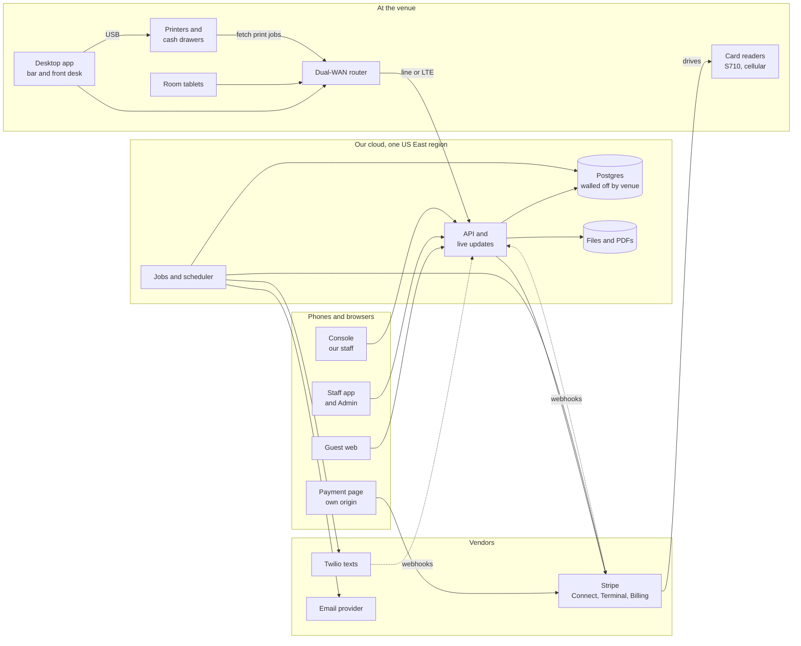

# Technical spec

Sep 29, 2026 · @Abhishek Gaire

Phase 1 puts West 4 live on a backend built for many venues: one Postgres database walled off by venue, a TypeScript API, web apps for guests, staff and admins, a desktop app at the bar, and Stripe Connect with card readers for every payment.

**Revised Sep 29** to apply the Sep 28 fix brief and reviews: the Front desk role, approvals on the approver's own phone, the phase 1 additions and a new milestone plan, with each decision and why in [decisions](../decisions.md).

## Scope and architecture

Phase 1 ships what West 4 needs for a real Friday night, from rooms and bar tabs to payments, texts and close-out, on foundations built for many venues, so venue two needs setup, not a rewrite. Staff screens ship in English and Spanish. Phase 1 also ships a minimal internal Console for our own staff: support grants, emergency actions, two-person rule-pack publishing and the module allow-list. The setup wizard, the website builder, the full control panel, the kitchen display and the rest of the kitchen module, and Korean and Chinese staff screens stay in phase 2, as the blueprint plans; printed kitchen tickets come into phase 1 for Sing Sing Astoria, the first venue to go live ([D98](../decisions.md), [Kitchen and food](16-kitchen.md), a draft). [Milestones](../milestones.md) gives every phase 1 deliverable a milestone and lists what waits for later.

Every screen talks only to the API. The API drives card readers through Stripe, network printers fetch their jobs from the API, and every change reaches the screens through one event stream. In the diagram, solid arrows are requests and dotted arrows are webhooks; the live updates go back to the screens over the same connections.

| Part | Job | Built with | Runs on |
| --- | --- | --- | --- |
| API | All rules, money math, Stripe and Twilio calls | TypeScript on Node.js 22 LTS with Fastify; nothing outside the database is called inside a database transaction | Two or more containers per role, across two availability zones in one US East region |
| Jobs and scheduler | Captures, confirmations, reminders, refunds, escalations, exports, retention | A `jobs` table in Postgres claimed with `SKIP LOCKED`; one scheduler under an advisory lock | Separate worker pools: critical (payments and readers), normal (texts), bulk (exports and retention) |
| Database | Every venue's data, walled off by venue | PostgreSQL 16 with [row-level security](https://www.postgresql.org/docs/16/ddl-rowsecurity.html); plain SQL migrations | Managed Postgres with a standby in a second zone, and continuous point-in-time backups copied to a second region |
| Live updates | Bar alarm, board tiles, room clocks, order status | A `venue_events` table written with each change; one relay, the leader under an advisory lock, stamps `seq` in commit order; every API container tails the table by `seq` and pushes to its own WebSockets, with NOTIFY only as a wake-up | The API containers, on a dedicated database connection |
| Files and PDFs | Damage photos, uploads, the menu PDF, receipts, dispute evidence | S3-compatible object storage; an HTML-to-PDF job | Same region, copied to the second region |
| Email | Invites, account recovery, emailed receipts and reports | A transactional email provider | The provider |
| Staff app | Board, room tabs, the bar POS and bar orders screen, runs, calendar, messages, reports, admin | React and Vite; one codebase for phone and desktop layouts; the app shell cached by a service worker | Browsers, installable on staff phones; served from its own hostname, outside the guest CDN |
| Desktop app | Alarm sound, USB printers, cash drawer, badge reader, offline view | Electron around the staff app, with an encrypted SQLite cache and a watchdog | Windows or macOS at the bar, and a small PC at the front desk for its USB printer and drawer |
| Console | Our own staff's tool; the minimal phase 1 version has support grants, emergency actions, two-person rule-pack publishing, the module allow-list and venue health | The staff app's stack on its own hostname, behind our single sign-on with FIDO2 keys | Our staff's browsers |
| Guest web | Venue site, booking, manage-booking, waitlist, ordering from the room | Next.js, server-rendered so search engines can read it; the payment step on its own origin | A CDN in front of the guest routes |
| Room tablets | Room clock, ordering, call staff | The guest web in managed kiosk mode | Venue Wi-Fi, online only |
| Card readers | Every in-person card payment | Stripe Reader S710 at every pay point, the only model with cellular (S700 and WisePOS E work, without that backup), [server-driven](https://docs.stripe.com/terminal/payments/setup-integration?terminal-sdk-platform=server-driven) | Venue Wi-Fi, with [cellular](https://docs.stripe.com/terminal/fleet/cellular) turned on for every venue |
| Venue router | Keeps the venue online when its internet line drops | A dual-WAN router with LTE on a different carrier from the readers, registered as a device | The venue |
| Printers | Bar tickets, receipts, drawer kick | Star CloudPRNT and Epson Server Direct Print, or USB through a desktop-app host | Venue network |
| Texts | Confirmations, reminders, room ready, receipts, two-way replies | Twilio Messaging on 10DLC, one subaccount per venue | Twilio |

**Why server-driven readers.** Staff phones and the bar computer never talk to the reader directly. They ask our API, which tells Stripe, which tells the reader. Any device works, nothing is installed, and a phone on cellular data can still take a card when the venue's internet is down. The trade-off is that server-driven readers [can't store payments offline](https://docs.stripe.com/terminal/payments/setup-integration?terminal-sdk-platform=server-driven); that needs Stripe's native SDK.

**Targets.** Phase 1 publishes these, and alerts fire when one is at risk:

| Target | Value |
| --- | --- |
| Ordering, payments and printing available during opening hours | 99.9% a month |
| Order to bar alarm | Under 3 seconds for 95% of orders |
| Card payments that don't fail on our side during opening hours (timeouts, unknown results, 5xx answers, reader offline; card declines don't count) | 99.5% |
| Data we can lose (RPO) | At most 1 minute within the region, 15 minutes across regions |
| Time to recover (RTO) | 5 minutes for a lost zone, 2 hours for a lost region |

**When the venue's internet drops:**

1. The readers switch to cellular. Stripe leaves cellular [off by default](https://docs.stripe.com/terminal/fleet/cellular), so every venue's Terminal Configuration sets `cellular[enabled]=true`, and Stripe bills cellular per reader each month. Payments can fail for [about 15 seconds to 2 minutes](https://docs.stripe.com/terminal/features/operate-offline/network-transitions) while a reader switches. Stripe documents the switch when Wi-Fi is lost; whether a reader also switches when Wi-Fi stays up but the line behind it is dead is one of the outage drill's cases.
2. The dual-WAN router moves the venue onto LTE, so the bar computer, printers, tablets and readers stay online over Wi-Fi. The router's vendor API, or the carrier behind the bar computer's public IP, shows the switch, and the board shows "On backup internet".
3. If both fail, the cloud stays the only writer. The desktop app shows a read-only board and open tabs and keeps ringing the orders it has without a PIN. New orders can be queued only as requests that the server checks again on replay ([Devices, printing and offline](09-devices-printing-offline.md)).
4. Store-and-forward card payments through the native SDK stay a phase 2 decision. The venue carries the decline risk, a stored payment can't grow a bar-tab hold, and Stripe caps each at [$10,000](https://docs.stripe.com/terminal/features/operate-offline/collect-card-payments?terminal-sdk-platform=android).

**When our cloud is down.** The desktop app treats it like an internet drop. Staff take cards with Tap to Pay in [Stripe's Dashboard app](https://docs.stripe.com/no-code/in-person) on a manager's phone, following the one-page break-glass card, or take cash; those payments land in Unmatched payments and are matched to checks afterwards. That needs each manager to have a Stripe Dashboard login on the venue's account and a phone Stripe supports for Tap to Pay (an iPhone XS or later, or a supported Android phone), which the go-live checklist checks (milestone M4, until the setup wizard does it in phase 2) and the outage drill uses. If Stripe itself is down, Tap to Pay is down too, so the venue takes cash, and our vendor-health checks put a banner on staff screens for Stripe, Twilio and the CDN. Losing a whole region means a scripted warm standby in the second region, a DNS cutover runbook and a yearly drill.
