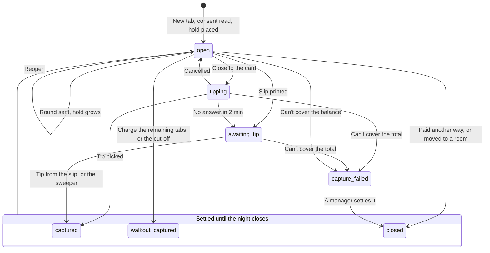

## Payment flows

Every flow follows Stripe's rules against double charges: one PaymentIntent per payment, the same PaymentIntent reused after a decline with a new attempt, and no hold canceled until its replacement has succeeded.

### How every card payment runs

1. **Write first.** A short transaction inserts the payment, its attempt, an in-progress allocation and a job, and commits. Nothing waits on Stripe inside a database transaction.
2. **Call Stripe** outside any transaction, with a 10 to 15 second timeout and the attempt's key.
3. **Record the result** in a second short transaction, through the payment state machine.
4. **Unknown means unknown.** A timeout, `terminal_reader_timeout` (which [Stripe says](https://docs.stripe.com/terminal/payments/collect-card-payment?terminal-sdk-platform=server-driven) can be a false negative), a connection error, a 5xx answer, or a reader action still `in_progress` after 20 seconds marks the attempt `unknown`. The server polls the reader and the PaymentIntent every 2 seconds for up to 2 minutes, and staff see "Checking with Stripe · don't retry". An unknown attempt keeps its allocation, and the unique index allows one unfinished attempt per check portion, so nobody can start a second payment for the same amount. Another way to pay is offered once the PaymentIntent is canceled, which is enough on its own; `cancel_action` goes to the reader too, but can fail while the reader is offline. If the cancel fails because the payment went through, the success is recorded.
5. **Reconciler.** Every 5 minutes a job resolves attempts that have been unknown for more than 2 minutes, and looks for PaymentIntents on the venue's account with no committed row. It adopts one only if it's on the payment's organization account and the amount matches; anything else, such as a break-glass Tap to Pay payment from Stripe's Dashboard app, goes to Unmatched payments for a manager to match to a check ([Stripe setup](06-stripe-setup.md)).

### What staff see during a card payment

The room tab on desktop and phone, the bar POS pay panel and each split share show the same states. Card payments pick a reader first: Front desk S710 or Bar S710.

| State | When | Staff see | What they can do |
| --- | --- | --- | --- |
| Waiting | The reader shows the amount | "Waiting for a tap on the front-desk reader · Cancel" | Cancel sends `cancel_action` to the reader |
| Paid | The PaymentIntent succeeded | Paid, then the receipt choices | — |
| Declined | `card_declined`; the PaymentIntent waits for another card | "Declined · try another card or cash" | Tap again, as a new attempt on the same PaymentIntent, or take cash |
| Unknown | A timeout, `terminal_reader_timeout`, a 5xx answer or an action still running after 20 seconds (step 4) | "Checking with Stripe · don't retry" | Nothing until it resolves; no second payment can start for that amount |
| Reader offline | `terminal_reader_offline` (our `reader_offline`), or no heartbeat for 2 minutes | "Reader offline · use the bar reader" (or the front-desk reader) | Pick the other reader, or take cash |
| Reader busy | `terminal_reader_busy` (our `reader_busy`): another payment is on it | "Reader busy" | Wait, or pick the other reader |
| Waiting for the guest | A card on file needs the guest's OK | "Waiting for Marcus to confirm on his phone · Cancel"; if the guest has left, "Ask a manager to approve" | Cancel, or send it to a manager with a reason |
| Hold raise declined | A bar tab's `increment_authorization` was declined; the old hold stays good | The tab's badge "Hold raise declined": new drinks need a manager's OK until another card is added | Add another card, or ask a manager |

### Deposit when booking online

1. **Hold the room.** Choosing a slot assigns a real room, places a 10-minute hold on it and creates a pending booking. The form has a CAPTCHA checked on the server and daily limits per phone number, IP address and device, and each booking has one PaymentIntent, reused on every retry.
2. **Show the terms.** The payment step runs on its own minimal page (Security and data retention) and loads Stripe's Payment Element for the venue's account. The API creates the PaymentIntent with `setup_future_usage=off_session` and a Customer on the venue's account. Above the pay button, the current policy version says which later charges can go on this card (the rest of the tab and a no-show charge), how each amount is worked out and when. Paying records the policy version and its hash, the time, the IP address and the browser.
3. **Confirm.** The booking confirms when the server, fetching the PaymentIntent itself on the page's return from Stripe, sees that it succeeded, or on `payment_intent.succeeded`, whichever comes first, and a reconciler checks any booking still pending after 2 minutes. If the payment lands after the hold lapsed, the room is checked again, and the payment is refunded if the room has gone.
4. **Cancel and no-show.** The refund cut-off is fixed when the booking is first confirmed, and later changes can't push it later. Cancelling before the cut-off refunds automatically. Later cancels and no-shows follow the accepted policy version, as an amount kept and an amount charged: keep the deposit, refund half, or charge up to the first hour in total, off-session on the saved card. If an off-session charge fails, the guest is texted a pay link.
5. **Changes.** A bigger party or a bigger room recomputes the deposit and collects the difference on the guest's screen. A smaller one refunds the excess only before the refund cut-off; after it, the deposit already paid stays and comes off the bill at check-in.
6. **The venue cancels.** Closing or blocking a booked date lists the bookings it affects, and a cancellation by the venue always refunds in full.
7. **Staff and big-party bookings** get a payment link (`POST /bookings/{b}/payment-link`). The guest opens it, accepts the policy and pays on their phone, and the booking stays pending until then. When a venue takes no deposit, `cardHold` mode saves the card with a SetupIntent under the same consent record.

**What the guest sees on the booking page.** Each step is its own state of the page, and the policy wording comes from Admin → Deposits, which the booking page and the manage page both read:

| Step | The guest sees |
| --- | --- |
| Pick | Date, party size with the billable minimum shown (a party of 3 can book on a Friday and pays for 4), time and length. Choosing a slot holds a real room for 10 minutes, with a countdown on every later step |
| Details | Name, mobile and email; a line saying the confirmation and reminders come by text to that number; and an unticked box for marketing texts, separate from the booking |
| Terms | The policy version above the pay button: the deposit comes off the bill; the card is saved, and the rest of the tab and a no-show charge can go on it later, with how each amount is worked out and when; the refund cut-off; and the gratuity sentence, "A 20% gratuity is added to room tabs." |
| Payment | The Payment Element on its own page (Apple Pay, Google Pay or card), and "Pay $60 deposit" |
| Confirmed | The room size, date and time, the deposit paid, "Free to cancel until Fri 9:30 PM", the gratuity sentence, that the confirmation text went to their number, and a link to manage the booking. The Booking confirmed text says the same ([Song systems and texts](11-song-systems-texts.md)) |
| Failures | A declined card asks for another card on the same PaymentIntent. A hold that ran out before paying sends the guest back to pick a time. A payment that lands after the hold lapsed, when the room has gone, is refunded in full and says so. While the server waits for Stripe's answer, the page shows that it's still checking, never a second pay button |

### Room close-out

Close-out runs on the room tab, on the desktop and on a staff phone, in four steps.

1. **Present the check.** This finalizes the check (Room 9's is #1042) and locks ordering from the room (`room_sessions.ordering_locked`). The guests' phones show "Your bill is ready · ordering is closed", with the bill link. It's refused while any order on the room is ringing or asked to wait, and those are listed first: "2 × Margarita · Peach is ringing at the bar · accept or cancel it first" ([Money rules](05-money-rules.md), rule 6). A manager can Reopen the check, and the next finalize writes a new revision.
2. **Ways to pay,** mixed as needed:

| Way to pay | Stripe calls | Notes |
| --- | --- | --- |
| Tap at the reader | PaymentIntent (`card_present`, automatic capture), then `process_payment_intent` on the picked reader with `process_config[skip_tipping]=true` | Offered first whenever the guest is there: [Stripe's in-person price](https://stripe.com/pricing) (2.7% + 5¢) and better protection in disputes. Room checks carry the 20% gratuity, so the reader skips its tip screen. The states are in the table above |
| Card on file | PaymentIntent with the saved card, `off_session=true`, `confirm=true` | Only after the guest confirms on their phone ("Waiting for Marcus to confirm on his phone · Cancel"), from the bill page or their booking link, or, when the guest has left, with a manager's approval and a reason (`mit_reason`). Never more than the amount due, and an itemized receipt is texted at once. Online price (2.9% + 30¢) |
| Cash | None | The bar POS's cash panel: the amount handed over (Exact, the next $5, $10 or $20, or Other), the change due in large type, "Wrong amount? Fix the change", and a cash-tip field. Records the amount handed over, the change, the tip, and the drawer session or staff bank now holding the cash. The drawer opens through the receipt printer |
| Split | One PaymentIntent per card; cash parts recorded | Even or by item. Each share has its own way to pay and its own state, shares are saved on the server so they're kept when staff leave the screen, and leftover cents go to the first shares by largest remainder. Each share is an allocation, and the check is paid when the allocations cover the amount due |
| Pay my share | PaymentIntent (`card_online`) through the Payment Element on the guest's phone | Guests pay their own shares from the room page (below). Each shows on the check as a line, such as "Paid by a guest · Kevin (share 1 of 12) $41.55", which is $498.60 ÷ 12 |

3. **Additional tip.** An "Additional tip (optional)" line, entered by staff, by cash or card. The receipt prints "Gratuity included (20%)" and calls any tip "Additional tip (optional)".
4. **Paid in full, then the receipt:** Text, Email, Print or No receipt. Then "Room 9 goes to cleaning", which is blocked while any order on the room is ringing, asked to wait or unpaid. An order accepted after the check is paid opens a new check, which staff settle before the room is released.

Room 9's $498.60 goes on a tap first; the Amex that paid the deposit is the fallback. New York requires venues to take cash on site, so every guest flow also offers "Pay cash to staff". A venue that takes no deposits can open each room with a card hold at check-in instead (`roomHold` in the pay settings), which works like a bar tab's hold; it's off at West 4.

**The guest's bill.** After Present the check, the guest's room page and their booking link open "Your bill": the itemized total, the deposit, the gratuity, "Pay with Amex ··1005" (which is how the guest confirms a card on file), Pay another way, and Pay cash to staff.

**Pay my share.** The bill page offers Pay my share when the venue turns it on (`pay.payShare`, on at West 4; a setting because an online card costs 2.9% + 30¢ against 2.7% + 5¢ in person). The guest picks My items or An even share (1 of N) and sees their share of tax and gratuity. An even share divides what was left to pay when the check was presented into N shares in cents, N starting at the party size, with leftover cents going to the first shares, so a share doesn't change as others pay. They pay with Apple Pay, Google Pay or a card through the same Payment Element as the booking page, on our payment page, as a direct charge on the venue's account ([Stripe setup](06-stripe-setup.md)). There's no tip prompt, since the gratuity is on the check. Each share is its own payment, allocated to the room's check and never more than the amount due, and staff see it land as a line on the room tab. The booker's card still guarantees the rest.

### Bar tab with a growing hold

The states are `tabs.state` in the [Data model](04-data-model.md). The box only groups the three settled states, which can be reopened until the night closes; it isn't a state of its own.

**The consent line.** The reader can't show our own consent line, so the New tab panel shows it for the bartender to read out before the tap, exactly: "We'll hold $50 on this card and add to it as you order. We charge your tab when you close out, or at 4:30 AM if it's still open. Add your tip on the reader." Read to guest ✓ beside it records who read it (`tabs.consent_read_by`) with the wording's version (`tabs.consent_text_version`, a `policy_versions` row), and the tab slip prints the same line. The hold and the time come from the `tabs` settings, so another venue reads out its own numbers.

1. **Open.** The API creates a PaymentIntent on the venue's account with `payment_method_types[]=card_present`, `capture_method=manual`, `payment_method_options[card_present][request_incremental_authorization_support]=true` and `setup_future_usage=off_session` with a Customer, for the opening hold from settings, such as $50. The bar reader collects the card first, with `collect_payment_method` and `collect_config[skip_tipping]=true` and `collect_config[allow_redisplay]=limited`, which Stripe requires with `setup_future_usage` since API version [2024-09-30.acacia](https://docs.stripe.com/changelog/acacia/2024-09-30/terminal-remove-customer-consent-require-allow-redisplay). The API calls `confirm_payment_intent` only after checking the card: if its fingerprint matches an open tab at the venue, the PaymentIntent is canceled unconfirmed, no second hold is placed, and the bar POS opens that tab instead. A phone and the plastic card behind it read as two cards, so this catches repeat taps, not every duplicate. A dip or swipe brings the cardholder's name; a tap or a phone doesn't, so staff pick a label such as Seat 3, and the brand and last four always show. Drinks rung on Quick sale before the card was taken move onto the new tab unsent, and the hold grows when they're sent.
2. **Check the card.** After it succeeds, store `incremental_authorization_supported`, overcapture support, `amount_authorized`, `capture_before`, and the saved card (`generated_card`) if [Stripe returned one](https://docs.stripe.com/terminal/features/saving-payment-details/save-after-payment?terminal-sdk-platform=server-driven); wallet taps may not. If the hold can't grow, orders are capped at the hold plus the overcapture allowance, minus a 25% tip reserve, and the bar screen says so.
3. **Grow.** When an order would take the tab near the hold, call [`increment_authorization`](https://docs.stripe.com/terminal/features/incremental-authorizations) with a new total. Steps are sized to finish within 8 of Stripe's 10 attempts (declines count), keeping 2 for closing, and each step's key names its target amount. Growing only works while the reader and the API are online.
4. **A declined raise** returns `card_declined`, and the old hold stays good. The tab's badge reads "Hold raise declined", and new drinks on it need a manager's OK until another card is added. A drink moved onto the tab runs the same check as a send.
5. **Close.** The final total is items plus tax, plus a gratuity if the venue adds one to bar tabs; with a gratuity on the tab the reader skips the tip, and the receipt reads "Gratuity included". With the guest at the bar, the tab moves to `tipping` and the bar reader asks for the tip through [`collect_inputs`](https://docs.stripe.com/terminal/features/collect-inputs?terminal-sdk-platform=server-driven): a selection of the venue's three percentages of the drinks before tax (18, 20 and 22% at West 4, or $1, $2 and $3 on a tab under $10), each shown with its amount, then Custom, which asks for a number, and No tip. The API captures the total plus the tip in one call, so nothing is left to type in later. Stripe lets bars [capture up to 50% more than the hold, or $50 more, whichever is greater](https://docs.stripe.com/terminal/features/collecting-tips/on-receipt); above that, the close raises the hold first and then captures. Anything still over goes on the saved card, or the tab becomes `capture_failed` for a manager. Paper is the fallback, for a reader that's offline, a guest who asks for a slip, or a tip screen left untouched for Stripe's 2 minutes: printing the slip moves the tab to `awaiting_tip`, the hold stays, and the tip goes in from the signed slip on a staff phone through the "Tips to enter" queue with a photo of the slip. A tip over 25% or $50, or one entered more than 2 hours late, needs approval.
6. **Walkouts and the cut-off.** Charge the remaining tabs on Close the night closes them sooner: after one confirmation that shows how many cards and the total, it captures every open tab that isn't waiting on an approval, each at its balance with no tip. At the tab cut-off (4:30 AM at West 4), a job closes every tab still `open` and captures its balance, up to the hold plus the overcapture allowance; anything left goes on the saved card or the tab becomes `capture_failed`, and the order times are kept as dispute evidence. A sweeper captures any tab still `awaiting_tip` 12 hours before its `capture_before`, at a tip of 0, and flags it. Any hold within 12 hours of expiring raises an alert, since an in-person hold lasts [at least two days, and 5 days for Visa](https://docs.stripe.com/terminal/features/extended-authorizations).
7. **Night close** needs no `open` or `tipping` tabs (a tip screen ends within 2 minutes) and allows `awaiting_tip` ones, and a tip entered after the Z report posts to the next business date. A `capture_failed` tab stays on the manager's list until it's settled and doesn't hold up the close; money collected for it later posts to the current business date. Paying a tab in cash cancels its hold.
8. **Split.** A split is saved on the server, so it survives leaving the pay panel and switching tabs. The tab list shows "Partly paid · $16.33 of $32.66", and the next charge is the rest. Shares are worked in cents by largest remainder: $32.66 ÷ 2 = $16.33 + $16.33, and for an odd amount the first share gets the extra cent. A share can be paid in cash, and "Stop splitting · charge the rest to …" ends the split. The tab stays `open`, its check `partly_paid`, until the last share is paid.
9. **Reopen.** A reopened tab whose hold was captured has no hold: its chip reads "Paid $272.19 · no hold", and it never offers "Close to card". New drinks are paid by a new tap, by cash, or by Charge the saved card (the card saved from the first tap, charged off-session), which needs the guest's confirmation on the bar reader, a Yes or No through `collect_inputs`, or a manager's OK. With $0 due, no pay buttons show.

### Paying with a different card

The guest taps a new card for the tab's balance on a new PaymentIntent, as a new attempt. Only after it succeeds does the API move the hold's allocation to it and cancel the old hold (`POST /v1/payment_intents/{id}/cancel`), which releases it. If the new card is declined, the tab stays guaranteed by the old hold.

### Songs on a tab

In bar mode, a queued song costs nothing. When staff or an adapter mark it started, a song line posts to the singer's tab: $0.00 when it uses a drink credit, or the venue's song price, which grows the hold if needed. Skip is free, and a prepaid credit comes back. A singer without a tab opens one with a tap, or pays cash to staff for prepaid song credit where the venue sets a song price ([Song systems and texts](11-song-systems-texts.md)).

### Moving a tab into a room

Move tab to a room, on the tab, lists the rooms in use. Every line moves as a transfer in one transaction: a `transfer_out` line on the tab and a `transfer_in` line on the room's check, which reads "Moved from Jess P.'s bar tab". The tab closes as "Moved to Room 9". A move runs the same checks as a send, so alcohol can't move onto a cut-off room, and where rooms carry holds the room's hold is raised first.

The tab's hold is canceled once the room has a payment method:

- **The booking's saved card,** from the online deposit: at once for Room 9, where Marcus's Amex ··1005 is saved.
- **The room's own hold,** where a venue opens rooms with one (`roomHold` in the pay settings, off at West 4): the room's tap, sized to its estimate, succeeds first.
- **A card tapped for the room,** for a walk-in with no saved card, such as Room 5: a SetupIntent through the reader (`process_setup_intent`) saves it without charging, with the guest's consent read out and stored as for a tab.

Until then the hold stays on the card as the room's guarantee for the moved lines: its allocation follows them onto the room's check, up to the hold, and the room tab shows the hold with the tab's name. Settling the room any other way cancels it ([Money rules](05-money-rules.md), rule 12).

### Refunds

**Refund from check.** Staff pick a paid check, then the lines, then which payment to refund, then a reason, then Send to Abhishek. Only owners and managers ask for a refund, and someone other than the requester approves it on their own phone, so Andy's requests go to Abhishek. The request shows "Waiting for Abhishek", then "Refund pending" until Stripe confirms, then "Refunded"; a refund that fails goes back to the manager with Stripe's reason. The amount can never exceed what was captured on that payment minus earlier refunds: Marcus has only his $120 deposit captured tonight, so his cap is $120. Refunds are offered on the staff phone (from the booking), on the room tab on desktop (a paid check) and on the bar POS (Closed tonight).

`POST /checks/{c}/refunds` takes the lines to refund, how much comes off each payment, a reason and approval. Once it's approved, it writes the reversing lines first (Money rules), then refunds each payment; before capture, it captures less or cancels instead. Each Stripe refund gets a `refunds` row whose status follows `refund.updated` and `refund.failed`, and screens say "Refund pending" until Stripe finishes, because a card refund waits when the venue's Stripe balance is short. A cash refund is a drawer move. A refund after the night is closed posts to the next open business date, pointing at its check's night ([D88](../decisions.md)). Gratuity refunded after its pool was paid comes off the next pool, once the lawyer confirms that's allowed.

### Card fee at the reader (off at West 4)

The reader has to report the card type before the amount is final:

1. Call [`collect_payment_method`](https://docs.stripe.com/terminal/payments/collect-card-payment?terminal-sdk-platform=server-driven) instead of processing in one step.
2. The `terminal.reader.action_updated` webhook carries the collected card; read its funding type.
3. For a credit card, update the PaymentIntent's `amount` and set `amount_details[surcharge][amount]` with Stripe's [surcharge API](https://docs.stripe.com/payments/cards/surcharge), a public preview on version `2026-03-25.preview`. The guest sees the new total and accepts it within Stripe's 30-second window between collecting and confirming, if Stripe confirms a server-driven reader can show the changed amount (Open technical questions). For debit and prepaid, change nothing.
4. Call `confirm_payment_intent`. When it succeeds, write the `card_surcharge` line and its tax line for that payment.

Stripe allows surcharges on US credit cards only, at up to 3%. A surcharge can only go down at capture and can't rise with a growing hold, so a venue with the fee on closes bar tabs with a fresh tap until Stripe confirms another way. Online deposits add the surcharge once the card is known, and a partial refund returns a matching share of it. This whole path gets a sandbox test before any venue turns the fee on.
